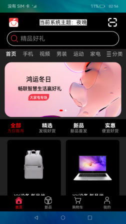

# 应用主题切换


### 介绍


本示例展示多种应用主题切换。通过创建 base 同级资源文件夹 dark 和 light 完成深色浅色主题相关资源配置，实现深色浅色主题切换，在 ThemeConst 文件中配置自定义主题文件，通过控制变量实现多主题切换。

通过[@ohos.application.abilityManager](https://gitee.com/openharmony/docs/blob/master/zh-cn/application-dev/reference/apis-ability-kit/js-apis-application-abilityManager-sys.md) 能力，对Ability状态进行修改：其中AbilityManager.updateConfiguration()通过修改colorMode属性来更新配置系统主题颜色。


### 效果预览

|                   **主页（白天模式）**                |             **黑夜模式**           |             **自定义模式**              |
| :---------------------------------------: | :---------------------------------------: |:----------------------------------:|
| | |   |

使用说明：

1. 点击头部切换主题按钮，选择想要切换的主题。
2. 系统深浅模式切换，应用主题自动跟随切换深浅模式。

### 工程目录

```
entry/src/main/ets/
|---models
|   |---ThemeConst.ets                  // 统一放置更换的主题资源
|---utils
|   |---ThemeGet.ets                    // 根据全局变量theme来控制主题模式
|---pages
|   |---Components
|        |---TitleBar.ets               // 头部导航栏，主题切换的控制
|   |---Index.ets                       // 首页
entry/src/main/resources/
|---base                                // 默认资源库
|   |---element                         // 字体相关资源
|   |---media                           // 图片资源
|   |---profile                        
|---dark                                // 黑夜模式资源
|   |---element                         
|   |---media                           
|---light                               // 白天模式资源
|   |---element                         
|   |---media                           


```


### 具体实现
* 三种模式资源统一放在ThemeConst内，在ThemeGet中定义全局变量theme控制主题模式(0:黑夜 1：白天 3：自定义主题)，源码参考[Index.ets](entry/src/main/ets/pages/Index.ets) ，步骤如下，
  * 1）整理主题资源：例如创建系统主题dark,light和自定义主题custom相关目录，并完善需要切换的资源比如icon、color等，系统主题下的相同资源，资源名称必须相同，比如dark下title.icon和light下title.icon
  * 2）定义资源池函数引用需要切换的主题资源，需要主题切换的资源通过getTheme(this.theme).资源名，实现组件对资源的动态引用和动态渲染。
  * 3）定义全局变量@storagelink('theme')
  * 4）定义事件修改变量theme的值，如果是系统主题（dark，light），调用AbilityManager.updateConfiguration()，通过修改colorMode属性来更新配置系统主题颜色（0：深夜 1：白天）
  * 5）自定义主题无须修改系统配置，只需修改theme全局变量的值，全局变量会通过@storagelink双向绑定机制，自动重新渲染绑定了theme值的组件


### 相关权限

允许更新系统配置：[ohos.permission.UPDATE_CONFIGURATION](https://gitee.com/openharmony/docs/blob/master/zh-cn/application-dev/security/AccessToken/permissions-for-system-apps.md#ohospermissionupdate_configuration)

### 依赖

不涉及。

### 约束与限制

1. 本示例仅支持标准系统上运行，支持设备：RK3568。
2. 本示例已适配 API version 9 版本 SDK，本示例涉及使用系统接口：@ohos.application.abilityManager，需要手动替换 Full SDK 才能编译通过，具体操作可以参考[替换指南](https://gitee.com/openharmony/docs/blob/master/zh-cn/application-dev/faqs/full-sdk-switch-guide.md) 。
3. 本示例需要使用 DevEco Studio 3.1 Beta2 (Build Version: 3.1.0.400, built on April 7, 2023)及以上版本才可编译运行。
4. 本示例所配置的权限 ohos.permission.UPDATE_CONFIGURATION 为 system_basic 级别(相关权限级别可通过[权限定义列表](https://gitee.com/openharmony/docs/blob/master/zh-cn/application-dev/security/AccessToken/permissions-for-system-apps.md) 查看),需要手动配置对应级别的权限签名(具体操作可查看[自动化签名方案](https://docs.openharmony.cn/pages/v4.0/zh-cn/application-dev/security/hapsigntool-overview.md))。

### 下载

如需单独下载本工程，执行如下命令：

````
git init
git config core.sparsecheckout true
echo code/SystemFeature/ResourceAllocation/ApplicationThemeSwitch/ > .git/info/sparse-checkout
git remote add origin https://gitee.com/openharmony/applications_app_samples.git
git pull origin master
````
