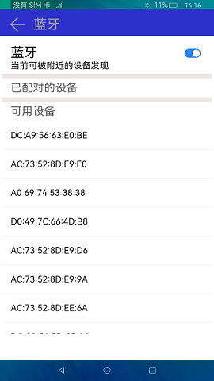
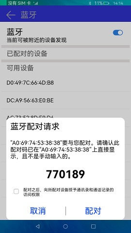
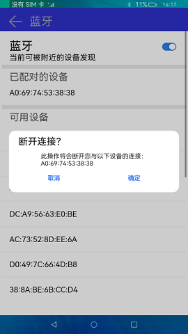

# 蓝牙（仅对系统应用开放）

### 介绍

蓝牙技术是一种无线数据和语音通信开放的全球规范，它是基于低成本的近距离无线连接，为固定和移动设备建立通信环境的一种特殊的近距离无线技术连接。本示例通过[@ohos.bluetooth](https://gitee.com/openharmony/docs/blob/master/zh-cn/application-dev/reference/apis-connectivity-kit/js-apis-bluetooth-sys.md) 接口实现蓝牙设备发现、配对、取消配对功能。实现效果如下：

### 效果预览

|发现设备|连接设备|断开连接|
|--------------------------------|--------------------------------|--------------------------------|
||||

使用说明

1.启动应用，若蓝牙本来就打开的，系统会直接搜索周围可配对的设备，若蓝牙未打开，打开开关。

2.搜索到附近的设备后，选择需要配对的设备，点击该设备，会跳出匹配弹窗，若确定匹配，点击**匹配**按钮，否则点击**取消**按钮。

3.若需要搜寻特定的设备可以使用命令"hdc shell ifconfig"命令查看被搜寻设备wlan的"HWaddr"字段地址，在已安装此应用的设备上点击相应的地址即可。

4.匹配后，若想删除匹配的设备，点击已配对的设备列表中的设备，会跳出断开连接弹窗，若确定删除该设备，点击**确定**，否则点击**取消**。

### 工程目录
```
entry/src/main/ets/
|---Application
|---Common
|   |---PinDialog.ets                  // 任务信息组件
|   |---TitleBar.ets                   // 标题组件
|---MainAbility
|---Model
|   |---Logger.ts                      // 日志工具
|---pages
|   |---Index.ets                      // 首页
```
### 具体实现

* 蓝牙设备发现、配对、取消配对等操作的功能结构主要封装在Index、PinDialog，源码参考:[Index.ets](entry/src/main/ets/pages/Index.ets) ，[PinDialog.ets](entry/src/main/ets/Commom/PinDialog.ets)
    * 启动和关闭蓝牙：在Index页面中通过Toggle组件的onChange函数来控制蓝牙的开关，开关打开的情况下会执行initBluetooth函数，关闭的情况下执行bluetooth.disableBluetooth()方法来断开蓝牙；
    * 验证蓝牙是否处于连接状态：蓝牙打开的时候通过bluetooth.on('stateChange')方法来监听蓝牙连接状态改变事件，确认已打开，则执行foundDevices()函数来查找设备接口，确认已关闭则执行bluetooth.stopBluetoothDiscovery()方法来停止查询接口。
    * 发现设备：在foundDevices()函数中通过bluetooth.on('bluetoothDeviceFind')方法来监听设备发现事件，并且通过bluetooth.getPairedDevices()方法来更新已配对蓝牙地址，然后通过bluetooth.startBluetoothDiscovery()方法开启蓝牙扫描，去发现远端设备，并且通过bluetooth.setBluetoothScanMode()方法来被远端设备发现。
    * 蓝牙配对：通过bluetooth.on('pinRequired')方法来监听远端蓝牙设备的配对请求事件，点击配对执行bluetooth.setDevicePairingConfirmation(this.data.deviceId, true)方法，点击取消执行bluetooth.setDevicePairingConfirmation(this.data.deviceId, false)方法。
    * 取消配对：最后通过bluetooth.cancelPairedDevice()来断开指定的远端设备连接。

### 相关权限

[ohos.permission.USE_BLUETOOTH](https://gitee.com/openharmony/docs/blob/master/zh-cn/application-dev/security/AccessToken/permissions-for-all.md#ohospermissionuse_bluetooth)

[ohos.permission.LOCATION](https://gitee.com/openharmony/docs/blob/master/zh-cn/application-dev/security/AccessToken/permissions-for-all.md#ohospermissionlocation)

[ohos.permission.DISCOVER_BLUETOOTH](https://gitee.com/openharmony/docs/blob/master/zh-cn/application-dev/security/AccessToken/permissions-for-all.md#ohospermissiondiscover_bluetooth)

[ohos.permission.MANAGE_BLUETOOTH](https://gitee.com/openharmony/docs/blob/master/zh-cn/application-dev/security/AccessToken/permissions-for-system-apps.md#ohospermissionmanage_bluetooth)

[ohos.permission.APPROXIMATELY_LOCATION](https://gitee.com/openharmony/docs/blob/master/zh-cn/application-dev/security/AccessToken/permissions-for-all.md#ohospermissionapproximately_location)

### 依赖

不涉及。

### 约束与限制

1.本示例仅支持标准系统上运行。

2.本示例已适配API version 9版本SDK，本示例涉及使用系统接口：cancelPairedDevice()，需要手动替换Full SDK才能编译通过，具体操作可参考[替换指南](https://gitee.com/openharmony/docs/blob/master/zh-cn/application-dev/faqs/full-sdk-switch-guide.md) 。

3.本示例需要使用DevEco Studio 3.1 Beta2 (Build Version: 3.1.0.400, built on April 7, 2023)及以上版本才可编译运行。

4.本示例所配置的权限ohos.permission.MANAGE_BLUETOOTH为system_basic级别(相关权限级别可通过[权限定义列表](https://gitee.com/openharmony/docs/blob/master/zh-cn/application-dev/security/AccessToken/permissions-for-system-apps.md) 查看)，需要手动配置对应级别的权限签名(具体操作可查看[自动化签名方案](https://gitee.com/openharmony/docs/blob/master/zh-cn/application-dev/security/hapsigntool-overview.md)) 。

### 下载

如需单独下载本工程，执行如下命令：
```
git init
git config core.sparsecheckout true
echo code/SystemFeature/Connectivity/Bluetooth/ > .git/info/sparse-checkout
git remote add origin https://gitee.com/openharmony/applications_app_samples.git
git pull origin master

```
