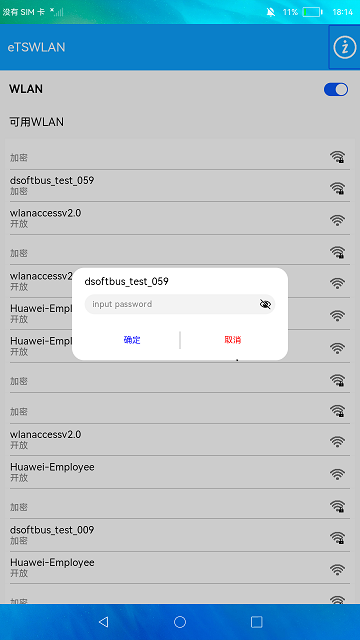

# WLAN（仅对系统应用开放）

### 介绍

本示例通过[@ohos.wifiManager](https://gitee.com/openharmony/docs/blob/master/zh-cn/application-dev/reference/apis-connectivity-kit/js-apis-wifiManager.md) 相关API实现wlan激活和关闭、扫描和连接WIFI等功能。

### 效果预览

|连接wifi                                     |主页                                     |wifi详情                                 |
|---------------------------------------------|---------------------------------------|-----------------------------------------|
||||

使用说明

1. 启动应用后会判断WLAN是否激活，如果是激活状态，会扫描并展示可用WiFi列表，同时获取已连接WiFi信息并展示；

2. 点击界面的Switch开关可以禁用和激活WLAN，界面会监听WLAN状态扫描可用WiFi列表，也会监听WiFi连接状态展示已连接WiFi；

3. 点击可用WLAN列表中的WLAN信息，可以连接WiFi，如果是加密类型，会弹窗输入密码后连接；

4. 点击首页右上角的**关于**图标，进入关于界面，展示获取的IP信息、国家码和支持WLAN相关特性信息。

### 工程目录
```
entry/src/main/ets/
|---component
|   |---AvailableWifi.ets      // 热点信息列表
|   |---BasicDataSource.ets    // 热点列表懒加载
|   |---InfoView.ets           // 列表中的每一项热点的展示栏
|   |---PswDialog.ets          // 输入密码的弹窗
|   |---TitleBar.ets           // 页面头部组件
|   |---WifiView.ets           // 已连接的wifi的详情页
|---entryability
|   |---EntryAbility.ets       // 应用入口，在这里请求相关权限和进入首页
|---model
|   |---Logger.ets             // 日志文件
|   |---WifiModel.ets          // 封装了wifi的接口
|---pages
|   |---About.ets              // wifi详情页
|   |---Index.ets              // 首页
```

### 具体实现

* wlan激活和关闭功能：点击首页的切换按钮，如果是打开，使用wifi.enableWifi()开启wifi；如果是关闭，则使用wifi.disconnect()断开wifi，
然后使用wifi.disableWifi()关闭wifi，
源码参考：[Index.ets](entry/src/main/ets/pages/Index.ets) 。

* wifi的连接、扫描、获取详细信息等功能封装在WifiModel模块中，源码参考：[WifiModel.ets](entry/src/main/ets/model/WifiModel.ets) 。
  * wifi的连接功能：点击wifi列表中加密的wifi，并在弹窗中输入密码后，会在[AvailableWifi.ets](entry/src/main/ets/component/AvailableWifi.ets) 中通过WifiModule.connectNetwork()调用wifi.connectToDevice()连接wifi，如图中的**连接wifi**。
  * wifi的扫描功能：进入[Index.ets](entry/src/main/ets/pages/Index.ets) 后就会间歇性的调用wifi.scan()开启扫描，然后通过WifiModel模块中的getScanInfos()调用wifi.getScanResults()来获取扫描的结果，如图中的**主页**。
  * 获取wifi的详细信息：在[About.ets](entry/src/main/ets/pages/About.ets) 中通过WiFiModel中的getIpInfo()、getCountryCode()、getFeatureSupport()分别调用wifi.getIpInfo()、wifi.getCountryCode()、wifi.isFeatureSupported()来获取对应信息。
  如图中的**wifi详情**。

### 相关权限

[ohos.permission.GET_WIFI_INFO](https://gitee.com/openharmony/docs/blob/master/zh-cn/application-dev/security/AccessToken/permissions-for-all.md#ohospermissionget_wifi_info)

[ohos.permission.GET_WIFI_INFO_INTERNAL](https://gitee.com/openharmony/docs/blob/master/zh-cn/application-dev/security/AccessToken/permissions-for-system-apps.md#ohospermissionget_wifi_info_internal)

[ohos.permission.SET_WIFI_INFO](https://gitee.com/openharmony/docs/blob/master/zh-cn/application-dev/security/AccessToken/permissions-for-all.md#ohospermissionset_wifi_info)

[ohos.permission.GET_WIFI_CONFIG](https://gitee.com/openharmony/docs/blob/master/zh-cn/application-dev/security/AccessToken/permissions-for-system-apps.md#ohospermissionget_wifi_config)

[ohos.permission.SET_WIFI_CONFIG](https://gitee.com/openharmony/docs/blob/master/zh-cn/application-dev/security/AccessToken/permissions-for-system-apps.md#ohospermissionset_wifi_config)

[ohos.permission.MANAGE_WIFI_CONNECTION](https://gitee.com/openharmony/docs/blob/master/zh-cn/application-dev/security/AccessToken/permissions-for-system-apps.md#ohospermissionmanage_wifi_connection)

[ohos.permission.APPROXIMATELY_LOCATION](https://gitee.com/openharmony/docs/blob/master/zh-cn/application-dev/security/AccessToken/permissions-for-all.md#ohospermissionapproximately_location)

### 依赖

不涉及。

### 约束与限制

1. 本示例仅支持标准系统上运行。

2. 本示例需要使用DevEco Studio 3.1 Beta2 (Build Version: 3.1.0.400, built on April 7, 2023)才可编译运行。

3. 本示例已适配API version 9版本SDK，版本号：3.2.11.9，本示例需要使用@ohos.wifi系统权限的系统接口。使用Full SDK时需要手动从镜像站点获取，并在DevEco Studio中替换，具体操作可参考[替换指南](https://gitee.com/openharmony/docs/blob/master/zh-cn/application-dev/faqs/full-sdk-switch-guide.md/) 。

4. 本示例需要使用ohos.permission.GET_WIFI_INFO_INTERNAL、ohos.permission.MANAGE_WIFI_CONNECTION的权限为system_core级别(相关权限级别可通过[权限定义列表](https://gitee.com/openharmony/docs/blob/master/zh-cn/application-dev/security/AccessToken/permissions-for-all.md) 查看)，需要手动配置对应级别的权限签名。

### 下载

如需单独下载本工程，执行如下命令：

```
git init
git config core.sparsecheckout true
echo code/SystemFeature/Connectivity/Wlan/ > .git/info/sparse-checkout
git remote add origin https://gitee.com/openharmony/applications_app_samples.git
git pull origin master
```