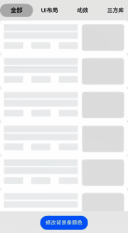
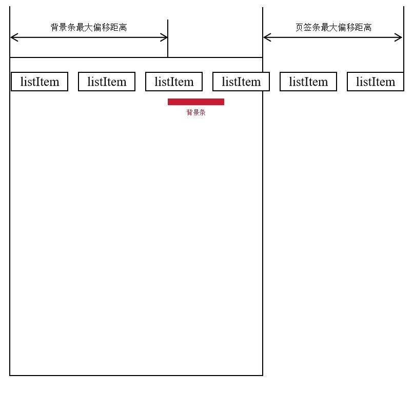
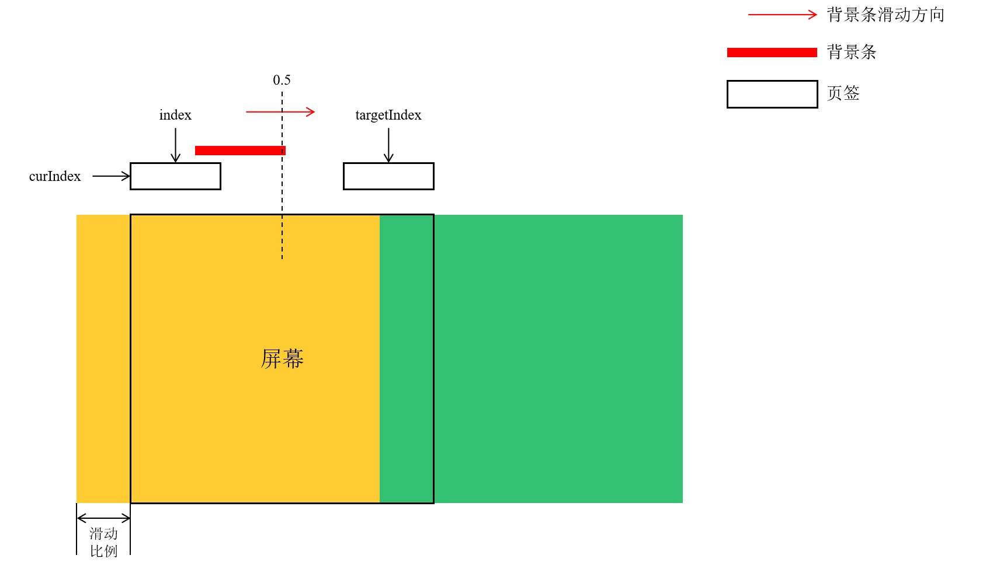
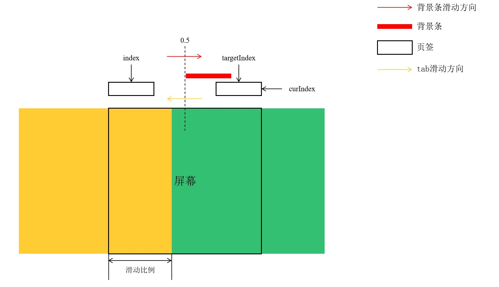
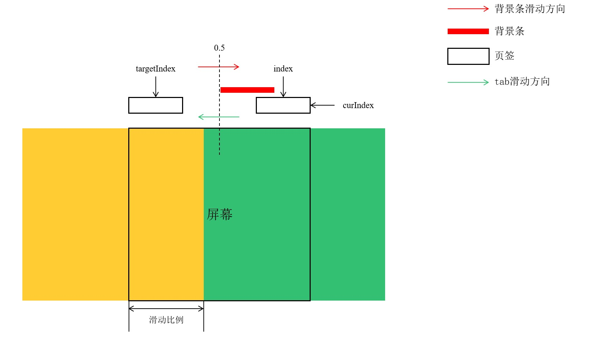

# 自定义动效tab

### 介绍
本示例介绍使用List、Text等组件，以及animateTo等接口实现自定义Tab效果

### 效果预览图



**使用说明**

1.选中页签，字体放大加粗且后面有背景条，起到强调作用。

2.手势触摸tab内容滑动，背景条跟随手势一起滑动。抬手时，当tab内容滑动距离不足一半时，会自动回弹，而当tab内容滑动距离大于一半时，背景条则会移动到下一个页签。当背景条滑动到一定距离后开始滑动页签条，使背景条始终能够保持在可视范围内。

3.点击页签，可以进行页签切换。

4.滑动页签条，背景条也会随之一起滑动，然后滑动tab内容，页签条会滑动到原处，使背景条处于可视范围内，之后背景条开始跟随手势滑动。

5.动画承接，背景条滑动过程中，触摸屏幕，背景条动画停止，松开手势，背景条继续滑动

### 下载安装

1.模块oh-package.json5文件中引入依赖
```typescript
"dependencies": {
  "customanimationtab": "har包地址"
}
```
2.ets文件import自定义视图实现Tab效果组件
```typescript
import {CustomAnimationTabView} from 'customanimationtab'
```


### 快速使用

本节主要介绍了如何快速上手使用自定义视图实现Tab效果组件，包括构建Tab组件以及常见自定义参数的初始化。

1.构建Tab

在代码合适的位置使用CustomAnimationTab组件并传入对应的参数（animationAttribute必须设置，其余参数可以使用默认值），后续将分别介绍对应参数的初始化。
```typescript
/**
 * 构建自定义Tab
 * animationAttribute: 动效属性
 * tabsInfo: tab数据源
 * indicatorBarAttribute: 背景条属性
 * tabBarAttribute: 页签条属性
 * tabController: 自定义动效tab控制器
 * scroller: 页签条滚动控制器
 */
CustomAnimationTab({
  animationAttribute: this.animationAttribute,
  tabsInfo: this.tabsInfo,
  indicatorBarAttribute: this.indicatorBarAttribute,
  tabBarAttribute: this.tabBarAttribute,
  tabController: this.tabController,
  scroller: this.scroller
})
```

2.动效属性初始化

动效属性基类为AnimationAttribute，其中封装了tab组件内部的动效属性。本示例中提供了开发自定义背景条颜色动效属性的代码。首先创建一个MyAnimationAttribute类，并继承AnimationAttribute基类，其中新增背景条颜色属性indicatorBarColor；之后创建MyAnimationAttribute状态变量对象animationAttribute，并将背景条颜色属性绑定到自定义背景条上，同时与button相关联，通过点击事件动态更改背景条颜色。（这里需要注意class对象属性级更新的正确使用）
```typescript
// 自定义动效属性，添加了背景条颜色变化
@State animationAttribute: MyAnimationAttribute = new MyAnimationAttribute($r('app.color.custom_animation_tab_indicator_color'));
```
```typescript
export class MyAnimationAttribute extends AnimationAttribute {
  // 背景条颜色
  indicatorBarColor: ResourceColor;

  constructor(indicatorBarColor: ResourceColor) {
    super();
    this.indicatorBarColor = indicatorBarColor;
  }
}
```
```typescript
@Builder
indicatorBar($$: BaseInterface) {
  Column()
    .height($r('app.float.custom_animation_tab_indicator_height'))
    .width($r('app.string.custom_animation_tab_one_hundred_percent'))
    // 绑定自定义动效属性
    .backgroundColor(this.animationAttribute.indicatorBarColor)
    .borderRadius($r('app.float.custom_animation_tab_indicator_border_radius'))
}

// 更新自定义动效变量——背景条颜色
Column() {
  Button($r('app.string.custom_animation_tab_button_text'))
    .height($r('app.string.custom_animation_tab_ninety_percent'))
    .type(ButtonType.Capsule)
    .onClick(() => {
      if ((this.animationAttribute.indicatorBarColor as Resource).id ===
      $r('app.color.custom_animation_tab_indicator_color").id) {
        this.animationAttribute.indicatorBarColor = Color.Yellow;
      } else if (this.animationAttribute.indicatorBarColor === Color.Yellow) {
        this.animationAttribute.indicatorBarColor = $r('app.color.custom_animation_tab_indicator_color");
      }
    })
}
.justifyContent(FlexAlign.Center)
.height($r('app.string.custom_animation_tab_ten_percent'))
.width($r('app.string.custom_animation_tab_one_hundred_percent'))
```

3.数据初始化

本小节主要介绍了如何初始化自定义Tab数据源。首先构建一个TabInfo数组，然后向其中传入对应的TabInfo对象，TabInfo对象主要需要传入三个属性——页签标题、tab页面内容视图以及页签组件。以base页面为例，首先创建一个@Builder函数，在该函数中填入struct组件，在struct组件中编写对应tab页面内容视图。然后，构建对应的页签样式tabBar，其中需要添加一个TabBarItemInterface类对象作为形参，其包括了一些必要属性，可以自定义样式修改，本示例中主要通过使用当前索引curIndex与页签索引index之间的比较来动态更改页签样式。
```typescript
// tab数据
tabsInfo: TabInfo[] = [];

this.tabsInfo = [
  new TabInfo(CustomAnimationTabConfigure.DEFAULT_BASE_TAB, wrapBuilder(baseBuilder), wrapBuilder(tabBar)),
  new TabInfo(CustomAnimationTabConfigure.DEFAULT_UI_TAB, wrapBuilder(uiBuilder), wrapBuilder(tabBar)),
  new TabInfo(CustomAnimationTabConfigure.DEFAULT_DYEFFECT_TAB, wrapBuilder(dyEffectBuilder), wrapBuilder(tabBar)),
  new TabInfo(CustomAnimationTabConfigure.DEFAULT_THIRTYPARTY_TAB, wrapBuilder(thirdPartyBuilder), wrapBuilder(tabBar)),
  new TabInfo(CustomAnimationTabConfigure.DEFAULT_NATIVE_TAB, wrapBuilder(nativeBuilder), wrapBuilder(tabBar)),
  new TabInfo(CustomAnimationTabConfigure.DEFAULT_OTHER_TAB, wrapBuilder(otherBuilder), wrapBuilder(tabBar))
]
  
// baseBuilder页面
import LazyDataSource from './LazyDataSource';
import { SkeletonLayout } from './SkeletonLayout';

@Builder
export function baseBuilder() {
  BasePage();
}

@Component
struct BasePage {
  @State data: LazyDataSource<string> = new LazyDataSource<string>();

  aboutToAppear(): void {
    for (let i = 0; i < 100; i++) {
      this.data.pushData(`${i}`);
    }
  }

  build() {
    Column() {
      List() {
        LazyForEach(this.data, (data: string) => {
          ListItem() {
            SkeletonLayout({isMine: false})
          }
        })
      }
      .cachedCount(1)
      .width('100%')
      .height('100%')
    }
    .width('100%')
    .height('100%')
  }
}

// 页签样式
@Builder
function tabBar($$: TabBarItemInterface) {
  Text($$.title)
    .fontSize($$.curIndex === $$.index ? $r('app.float.custom_animation_tab_list_select_font_size") : $r('app.float.custom_animation_tab_list_unselect_font_size'))
    .fontColor($r('app.color.custom_animation_tab_list_font_color'))
    .fontWeight($$.curIndex === $$.index ? FontWeight.Bold : FontWeight.Medium)
    .textAlign(TextAlign.Center)
}
```

4.背景条初始化

背景条可以通过IndicatorBarAttribute类进行配置，也可以使用已有的背景条配置（目前支持两种: IndicatorBarAttribute.BACKGROUNDBAR和IndicatorBarAttribute.THINSTRIP）。本示例主要介绍了构建IndicatorBarAttribute类进行背景条配置，其中传入了背景条组件indicatorBar ，背景条宽度模式设置为内边距模式，左右边距设为20，上下边距设为10，同时设置背景条最大偏移为CustomAnimationTabConfigure.INDICATOR_MAX_LEFT以及背景条宽度扩展比例为CustomAnimationTabConfigure.DEFAULT_INDICATOR_EXPAND。
```typescript
indicatorBarAttribute: IndicatorBarAttribute = new IndicatorBarAttribute(this.indicatorBar, SizeMode.Padding, 20, 10,
  CustomAnimationTabConfigure.INDICATOR_MAX_LEFT, CustomAnimationTabConfigure.DEFAULT_INDICATOR_EXPAND);

@Builder
indicatorBar($$: BaseInterface) {
  Column()
    .height($r('app.string.custom_animation_tab_one_hundred_percent'))
    .width($r('app.string.custom_animation_tab_one_hundred_percent'))
    .backgroundColor(this.animationAttribute.indicatorBarColor)
    .borderRadius($r('app.float.custom_animation_tab_indicator_border_radius'))
}
```

5.页签条初始化

页签条属性通过TabBarAttribute类进行配置。本例中主要配置了各个页签的宽度大小以及页签条高度。
```typescript
tabBarAttribute: TabBarAttribute = new TabBarAttribute(CustomAnimationTabConfigure.LIST_ITEM_WIDTH, CustomAnimationTabConfigure.TABBAR_HEIGHT)
```

6.tab及页签条控制器初始化

自定义Tab控制器以及页签条控制器分别通过CustomAnimationTabController和Scroller初始化，分别用于控制自定义Tab与页签条的行为。
```typescript
// tabController
tabController: CustomAnimationTabController = new CustomAnimationTabController();
// scroller
scroller: Scroller = new Scroller();
```

### 属性(接口)说明

CustomAnimationTab组件属性

|          属性           |                                                                             类型                                                                             |                            释义                            |    默认值    |
|:---------------------:|:----------------------------------------------------------------------------------------------------------------------------------------------------------:|:--------------------------------------------------------:|:---------:|
|  animationAttribute   |                                                                     AnimationAttribute                                                                     |     封装了包括背景条长度、背景条高度以及背景条左边距在内的动效属性，使组件内部对应的属性可以动态变化     | undefined |
|       tabsInfo        |                                                                         TabInfo[]                                                                          |                          tab数据源                          |     -     |
| indicatorBarAttribute |                                                                   IndicatorBarAttribute                                                                    |                背景条属性类，配置背景条组件，以及背景条相关的属性                 |     -     |
|    tabBarAttribute    |                                                                     AnimationAttribute                                                                     |                    页签条属性类，配置页签条相关的属性                     |     -     |
|     tabController     |                                                                 CustomAnimationController                                                                  |                 tab控制器，用于控制tabs组件进行页签切换                  |     -     |
|       scroller        |                                                                          Scroller                                                                          |                    页签条控制器，可以控制页签条的滚动                     |     -     |
|   animationDuration   |                                                                           number                                                                           |            页签切换时长，控制页签切换时背景条滑动以及tab页面之间切换的时长             |   240ms   |
|      startIndex       |                                                                           number                                                                           |                        配置起始的页签索引                         |     0     |
|   gestureAnimation    |                               (index: number, targetIndex: number, elementsInfo: [number, number][], ratio: number) => void                                |                  配置在tab页面上手势滑动时背景条的跟手动效                  |     -     |
|     autoAnimation     |                               (index: number, targetIndex: number, elementsInfo: [number, number][], ratio: number) => void                                |                  配置在tab页面上离手后背景条的自动滑动动效                  |     -     |
|    clickAnimation     | (index: number, targetIndex: number, indexInfo: Record<string, number>, targetIndexInfo: Record<string, number>, elementsInfo: [number, number][]) => void |                     配置点击页签时背景条的滑动动效                      |     -     |
|     getScrollInfo     |                                                    (center: number, width: number) => [number, number]                                                     | 获取页签对应的背景条左边距以及页签条偏移，通过该函数可以自行配置选中各个页签时背景条的左边距以及页签条的偏移情况 |     -     |

TabInfo类属性

|       属性        |                  类型                   |          释义          |    默认值    |
|:---------------:|:-------------------------------------:|:--------------------:|:---------:|
|      title      |                string                 |         页签标题         |     -     |
| contentbuilder  |          WrappedBuilder<[]>           |      tab页面内容视图       |     -     |
|   barBuilder    | WrappedBuilder<[TabBarItemInterface]> | 页签组件（没有配置，则使用内部默认配置） | undefined |

IndicatorBarAttribute类属性

|         属性          |               类型               |                                               释义                                               |         默认值          |
|:-------------------:|:------------------------------:|:----------------------------------------------------------------------------------------------:|:--------------------:|
|    indicatorBar     | (index: BaseInterface) => void |                                            自定义背景条组件                                            |          -           |
|      sizeMode       |            SizeMode            |                                            背景条宽度模式                                             |   SizeMode.Normal    |
|     innerWidth      |             number             |            1. 尺寸模式为正常模式，表示背景条宽度，值为0时则与页签宽度保持一致;<br/>2. 尺寸模式为内边距模式，表示背景条与页签项之间的左右边距             |          0           |
|     innerHeight     |             number             |            1. 尺寸模式为正常模式，表示背景条高度，值为0时则与页签高度保持一致;<br/>2. 尺寸模式为内边距模式，表示背景条与页签项之间的上下边距             |          0           |
| maxIndicatorBarLeft |             number             | 背景条最大偏移(<0: 无上限, >=0: innerMaxIndicatorBarLeft)，配置背景条最大的滑动距离，超过该距离后除非页签条滑动到了底部，否则滑动页签条，背景条不再滑动 |          -1          |
|   indicatorExpand   |             number             |                                  背景条宽度扩展比例，配置背景条在滑动过程中宽度扩展的比例                                  |          1           |
|      barAlign       |         VerticalAlign          |                                     背景条垂直布局，配置背景条相对于页签的位置                                      | VerticalAlign.Center |

TabBarAttribute类属性

|         属性         |      类型       |                           释义                            |        默认值        |
|:------------------:|:-------------:|:-------------------------------------------------------:|:-----------------:|
|    barItemWidth    |    Length     | 各个页签项的宽度（没有设置且尺寸模式为正常模式时，与页签同宽；没有设置且尺寸模式为内边距模式时，与背景条同宽） |     undefined     |
|     barHeight      |    Length     | 页签条高度（没有设置且尺寸模式为正常模式时，与首个页签同高；没有设置且尺寸模式为内边距模式时，与背景条同高）  |     undefined     |
|     scrollable     |    boolean    |       是否可以滚动页签条(false则所有页签等分屏幕宽度，barItemWidth失效)        |       true        |
|   barEdgeEffect    |  EdgeEffect   |                  页签条边缘滑动效果，支持弹簧效果和阴影效果                  | EdgeEffect.Spring |
|    barVertical     |  BarPosition  |                   页签条位置，处于tab内容的上方或下方                   | BarPosition.Start |
| barBackgroundColor | ResourceColor |                         页签条背景颜色                         | Color.Transparent |

BaseInterface属性

|    属性    |   类型   |    释义     | 默认值 |
|:--------:|:------:|:---------:|:---:|
| curIndex | number | 当前选中的页签索引 |  -  |

TabBarItemInterface属性

|    属性    |   类型   |    释义     | 默认值 |
|:--------:|:------:|:---------:|:---:|
| curIndex | number | 当前选中的页签索引 |  -  |
|  index   | number |  页签本身索引   |  -  |
|  title   | string |   页签标题    |  -  |

SizeMode属性

|   属性    | 类型 |                         释义                         | 默认值 |
|:-------:|:--:|:--------------------------------------------------:|:---:|
| Normal  | -  |             标准宽度模式，背景条尺寸通过背景条宽高属性显示设置              |  -  |
| Padding | -  | 内边距模式，背景条尺寸通过页签上下边距隐性设置 |  -  |

### 实现思路
本案例的功能主要分为两个部分：一是点击页签的切换，二是滑动tab的切换。在后续两小节将对以上两个部分进行详细介绍。以下是一些重要的变量名及其含义。
- maxListOffset：页签条最大偏移距离
- maxIndicatorBarLeft： 背景条最大偏移距离
- AnimationAttribute.left：背景条位置

#### 1.核心函数getScrollInfo

由于本案例页签动画效果分为两种不同类型的滑动，因此需要实现一个函数以分别获取每个页签对应的背景条位置以及页签条滑动偏移。

1.1 背景条最大滑动距离以及页签条最大滑动距离

（1）背景条最大偏移距离：背景条滑动到该处时不再向后滑动，此时页签条接管滑动。

（2）页签条最大偏移距离：当页签条接管滑动以后，当滑动到末尾时，无法向后滑动，此时背景条再次接管滑动。


1.2 三个阶段

从上面的两个概念，可以看出滑动主要可以分为三个阶段：1）背景条初始滑动阶段；2）页签条滑动阶段；3）背景条再次滑动阶段。

1.3 代码实现

结合以上两个小节的介绍，具体代码如下所示：
```typescript
/**
 * 获取页签对应的背景条位置以及页签条偏移
 * @param center - 页签中心点
 * @param width - 页签条宽度
 * @returns: [背景条左端位置, 页签条偏移]
 */
@Param getScrollInfo: (center: number, width: number) => [number, number] =
  (center: number, width: number): [number, number] => {
    // 获取背景条位置
    let indicatorLeft: number = center - this.indicatorBarWith / 2;
    // TODO: 知识点: 当背景条位置大于默认的背景条最大位置时，选取背景条最大位置作为背景条实际位置
    let finalIndicatorLeft: number = this.maxIndicatorBarLeft >= 0 ? Math.min(indicatorLeft, this.maxIndicatorBarLeft) : indicatorLeft;
    // TODO: 知识点: 背景条产生的多余距离作为页签条滑动距离
    let listOffset: number = indicatorLeft - finalIndicatorLeft;
    // TODO: 知识点: 当页签条偏移大于页签条可偏移量，选取页签条可偏移量作为页签条实际偏移
    let finalListOffset: number = Math.min(listOffset, this.maxListOffset);
    // TODO: 知识点: 页签条多余的偏移作为背景条后续的滑动距离
    finalIndicatorLeft += listOffset - finalListOffset;
    return [finalIndicatorLeft, finalListOffset];
  };
```
具体思路：首先根据页签的位置信息获取对应背景条的初始位置。    
1）第一阶段：背景条初始位置就是背景条的实际位置。      
2）第二阶段：当背景条偏移大于背景条最大偏移距离时，进入第二阶段。这时候后续多余的背景条偏移需要作为页签条偏移，以实现页签条移动。      
3）第三阶段：当页签条偏移大于页签条最大偏移量时，进入第三阶段。此时多余的页签条偏移会作为背景条的偏移，使背景条继续向后滑动。   

#### 2.点击页签的切换

- 首先在onChange回调中实现对应的动画效果，当事件为点击事件并且需要进行页签切换时才进入到对应的动画效果实现，其中首先通过获取index页签的中心位置计算背景条位置，以实现背景条移动到当前页签位置。然后，通过elementsInfo数组获取index页签对应的页签条偏移，从而对页签条进行滑动。而背景条的滑动则通过页签条的滑动回调函数onDidScroll来进行。

```typescript
// tab
Swiper(this.swiperController) {
  // 布局实现
}
.onChange((index: number) => {
  // 点击事件且发生页签切换
  if (this.listTouchState === 1 && index !== this.curIndex) {
    let indexInfo: Record<string, number> = this.getElementInfo(this.curIndex);
    let targetIndexInfo: Record<string, number> = this.getElementInfo(index);
    this.clickAnimation(this.curIndex, index, indexInfo, targetIndexInfo, this.elementsInfo);
  }
  this.curIndex = index;
  console.log(`curIndex: ${this.curIndex}`);
})

clickAnimation: (targetIndex: number, targetIndexInfo: Record<string, number>, elementsInfo: IndicatorAnimationInfo[]) => void =
  (targetIndex: number, targetIndexInfo: Record<string, number>, elementsInfo: IndicatorAnimationInfo[]): void => {
    // 根据targetIndex页签当前位置获取对应的背景条位置
    this.animationAttribute.left = targetIndexInfo.center - this.elementsInfo[targetIndex].width / 2;
    this.animationAttribute.indicatorBarWidth = this.elementsInfo[targetIndex].width;
    this.animationAttribute.indicatorBarHeight = this.elementsInfo[targetIndex].height;
    this.scroller!.scrollTo({xOffset: elementsInfo[targetIndex].offset, yOffset: 0, animation: {duration: this.animationDuration, curve: Curve.Linear}});
  };
```

- 在页签点击事件中触发页签切换事件，后续就会触发tab的onChange事件实现切换动画。

```typescript
// 页签点击事件
ListItem() {
  // 布局实现
}
.onClick(() => {
  this.listTouchState = 1;
  this.tabController.changeIndex(index);
})
```

#### 2.滑动Tab的切换

滑动页签切换主要分为两个部分：一个是背景条的滑动，一个是页签条的滑动。

2.1 手势跟踪

```typescript
Swiper(this.swiperController) {
  // 布局实现
}
.onGestureSwipe((index: number, event: TabsAnimationEvent) => {
  this.listTouchState = 0;
  let curOffset: number = event.currentOffset;
  let targetIndex: number = index;
  this.isReachBorder = false;
  // tab组件到达边界使背景条和页签条跳转到终点位置
  // TODO: 知识点: 这里不能判断到边界直接退出，因为onGestureSwipe每一帧触发回调，当手势滑动较快，上一帧背景条没有到达边界
  // TODO(接上): 知识点: 下一帧content超出边界，这时候背景条没有更新，退出将导致背景条停滞在上一帧位置无法更新。
  if ((index === 0 && curOffset > 0) ||
    (index === this.innerBarData.length - 1 && curOffset < 0)) {
    this.isReachBorder = true;
    curOffset = 0;
  }

  let ratio: number = Math.abs(curOffset / this.tabsWidth); // tab滑动比例
  if (curOffset < 0) { // tab右滑
    targetIndex = index + 1;
  } else if (curOffset > 0) { // tab左滑
    targetIndex = index - 1;
  }
  // 获取背景条位置及页签条偏移
  // 获取背景条位置及页签条偏移
  this.gestureAnimation(index, targetIndex, this.elementsInfo, ratio);
})

/**
 * 手势滑动动效
 * @param index - 起始页签索引
 * @param targetIndex - 目标页签索引
 * @param elementsInfo - 页签信息[背景条左端位置, 页签条偏移]
 * @param ratio - 当前手势滑动比例
 * @returns
 */
gestureAnimation: (index: number, targetIndex: number, elementsInfo: IndicatorAnimationInfo[], ratio: number) => void =
  (index: number, targetIndex: number, elementsInfo: IndicatorAnimationInfo[], ratio: number): void => {
    this.animationAttribute.left = elementsInfo[index].left + (elementsInfo[targetIndex].left - elementsInfo[index].left) * ratio;
    this.scroller!.scrollTo({xOffset: elementsInfo[index].offset + (elementsInfo[targetIndex].offset - elementsInfo[index].offset) * ratio, yOffset: 0});
    let indicatorSize: [number, number] = this.getIndicatorSize(ratio, index, targetIndex);
    this.animationAttribute.indicatorBarWidth = indicatorSize[0];
    this.animationAttribute.indicatorBarHeight = indicatorSize[1];
  };
```

具体思路： 手势跟踪滑动主要存在两种情况：1）背景条到达边界；2）背景条未到达边界。首先判断tab是否滑动到边界，若滑动到边界，则目标页签等于当前页签。否则，则根据当前的偏移情况来判断目标页签相对于当前页签的位置。然后，分别获取当前页签以及目标页签对应的背景条位置以及页签条偏移作为背景条和页签条的起始状态和最终状态。之后，可以通过计算tab滑动比例，获取当前背景条位置以及页签条偏移，公式如下所示：


2.2 动画效果

```typescript
Swiper(this.swiperController) {
  // 布局实现
}
.onContentDidScroll((selectedIndex: number, index: number, position: number, mainAxisLength: number) => {
  // 动画启动，选取当前index索引页签的属性来执行背景条和页签条滑动
  if (this.isAnimationStart && index === this.innerCurrnetIndex) {
    // 使用选中页签相对于Swiper主轴起始位置的移动比例判断滑动的目标页签targetIndex的位置
    let targetIndex: number = position < 0 ? index + 1 : index - 1;
    if (targetIndex >= this.innerBarData.length || targetIndex < 0) {
      console.warn(`Error: targetIndex exceeds the limit range:
            selectedIndex: ${selectedIndex}, curIndex: ${this.innerCurrnetIndex}, index: ${index},
            targetIndex: ${targetIndex}, position: ${position}, mainAxisLength: ${mainAxisLength}`);
      return;
    }
    let ratio: number = Math.abs(position);
    // 通过页签比例计算当前页签条和背景条的位置
    this.autoAnimation(index, targetIndex, this.elementsInfo, ratio);
  }
})
.onAnimationStart((index: number, targetIndex: number, event: TabsAnimationEvent) => {
  if (this.isReachBorder) { // 若tab到达边界，则不继续执行动画
    return;
  }

  this.isAnimationStart = true;
  this.listTouchState = 0;
})
.onAnimationEnd(() => {
  this.isAnimationStart = false;
})

/**
 * 自动滑动动效
 * @param index - 起始页签索引
 * @param targetIndex - 目标页签索引
 * @param elementsInfo - 页签动效信息[背景条左端位置, 页签条偏移]
 * @param ratio - 当前tab滑动比例
 * @returns
 */
autoAnimation: (index: number, targetIndex: number, elementsInfo: IndicatorAnimationInfo[], ratio: number) => void =
  (index: number, targetIndex: number, elementsInfo: IndicatorAnimationInfo[], ratio: number): void => {
    this.animationAttribute.left = elementsInfo[index].left + (elementsInfo[targetIndex].left - elementsInfo[index].left) * ratio;
    this.scroller!.scrollTo({
      xOffset: elementsInfo[index].offset + (elementsInfo[targetIndex].offset - elementsInfo[index].offset) * ratio,
      yOffset: 0
    });
    let indicatorSize: [number, number] = this.getIndicatorSize(ratio, index, targetIndex);
    this.animationAttribute.indicatorBarWidth = indicatorSize[0];
    this.animationAttribute.indicatorBarHeight = indicatorSize[1];
  };
```

具体思路：首先在动画开始时，在onAnimationStart回调中只进行动画开始状态的改变(i.e. this.isAnimationStart = true)。然后，在onContentDidScroll回调中进行绘制动画。具体来说，在每一次回调onContentDidScroll接口时通过起始页签index、目标页签targetIndex以及滑动比例来判断当前背景条位置以及页签条的偏移，如公式(1)所示。 因此，动画函数中最重要的就是判断index、targetIndex以及滑动比例。由于页签条的滑动等价于背景条滑动，因此只需要判断背景条的滑动情况就可以覆盖所有情况。如下图所示，这里主要存在以下三种情况的判断：1）背景条未回弹且滑动比例小于0.5；2）背景条未回弹且滑动比例大于等于0.5；3）背景条回弹。
- 背景条未回弹且滑动比例小于0.5。这时候起始页签index应该等于curIndex，而目标页签targetIndex则可以根据滑动比例正负判断index+1(index-1)。当tab不断向左(右)滑动时，index页签滑动比例不断增加，背景条也不断向右(左)滑动。

- 背景条回弹。这时候起始页签应该等于curIndex，而目标页签targetIndex则可以根据滑动比例正负判断index+1(index-1)。当tab回弹时，index页签滑动比例不断减少，背景条也不断向左(右)滑动，直至回弹到原位置。

- 背景条未回弹且滑动比例大于等于0.5。这时候目标页签应该等于curIndex，起始页签index应该则可以根据滑动比例正负判断targetIndex+1(targetIndex-1)。但是，仔细观察可以发现，其实这种情况与背景条回弹情况基本一致。可以将其看作是黄色页签开始向左滑动，也可以将其看作是绿色页签开始进行回弹。因此，可以将其转化为绿色页签回弹，如后续第二张图所示。这时候起始页签应该等于curIndex，而目标页签targetIndex则可以根据滑动比例正负判断index+1(index-1)。当index页签内容回弹时，tab滑动比例不断减少，背景条也不断向右(左)滑动，直至回弹到原位置。



### 高性能知识点

本示例使用了[LazyForEach](https://gitee.com/openharmony/docs/blob/master/zh-cn/application-dev/reference/apis-arkui/arkui-ts/ts-rendering-control-lazyforeach.md)进行数据懒加载，LazyForEach懒加载可以通过设置cachedCount属性来指定缓存数量，同时搭配[组件复用](https://gitee.com/openharmony/docs/blob/master/zh-cn/application-dev/performance/component-recycle.md)能力以达到性能最优效果。

### 工程结构&模块类型

```
customAnimationTabs                          // har类型
|---common
|   |---CommonConstants.ets                  // 内置常量定义 
|---model
|   |---AnimationAttribute.ets               // 动效属性
|   |---BaseInterface.test                   // 基础信息接口
|   |---ComponentFactory.ets                 // 组件工厂
|   |---CustomAniamtionTabController.ets     // 自定义tab控制器
|   |---IndicatorBarAttribute.ets            // 背景条属性
|   |---TabBarAttribute.ets                  // 页签条属性
|   |---TabBarItemInterface.ets              // 页签信息接口
|   |---TabInfo.ets                          // tab项信息
|---utils
|   |---CustomAnimationTab.ets               // customAnimationTab组件 
|---view
|   |---BasePage.ets                         // tab页面内容及页签
|   |---CustomAnimationTabConfigure.ets      // 用户配置
|   |---CustomAnimationTabView.ets           // 样例页面
|   |---DyEffectPage.ets                     // tab页面内容及页签
|   |---LazyDataSource.ets                   // 懒加载数据
|   |---NativePage.ets                       // tab页面内容及页签
|   |---OtherPage.ets                        // tab页面内容及页签 
|   |---SkeletonLayout.ets                   // 骨架页面
|   |---ThirdPartyPage.ets                   // tab页面内容及页签
|   |---UIPage.ets                           // tab页面内容及页签
|---FeatureComponent.ets                     // AppRouter入口文件
```

### 参考资料

[RelativeContainer](https://gitee.com/openharmony/docs/blob/master/zh-cn/application-dev/ui/arkts-layout-development-relative-layout.md)

[显式动画 (animateTo)](https://gitee.com/openharmony/docs/blob/master/zh-cn/application-dev/reference/apis-arkui/arkui-ts/ts-explicit-animation.md)

[轮播图 (Swiper)](https://gitee.com/openharmony/docs/blob/master/zh-cn/application-dev/reference/apis-arkui/arkui-ts/ts-container-swiper.md)

[列表 (List)](https://gitee.com/openharmony/docs/blob/master/zh-cn/application-dev/reference/apis-arkui/arkui-ts/ts-container-list.md)

### 相关权限
不涉及

### 约束与限制
1.本示例仅支持在标准系统上运行，支持设备：RK3568。

2.本示例为Stage模型，支持API12版本SDK，SDK版本号（API Version 12 Release）。

3.本示例需要使用DevEco Studio 5.0.0 Release 才可编译运行。

### 下载
如需单独下载本工程，执行如下命令：

```
git init
git config core.sparsecheckout true
echo code/UI/CustomAnimationTab/ > .git/info/sparse-checkout
git remote add origin https://gitee.com/openharmony/applications_app_samples.git
git pull origin master
```

