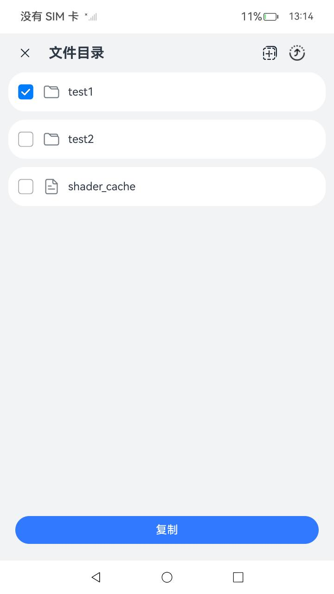

# 分布式文件管理

### 介绍

本示例使用分布式能力实现了一个分布式的文件管理，可以进行文件的跨设备拷贝。本示例仅适配设备类型为phone。

本示例用到了文件管理接口[@ohos.file.fs](https://gitee.com/openharmony/docs/blob/master/zh-cn/application-dev/reference/apis-core-file-kit/js-apis-file-fs.md)。

分布式数据对象接口[@ohos.data.distributedDataObject](https://gitee.com/openharmony/docs/blob/master/zh-cn/application-dev/reference/apis-arkdata/js-apis-data-distributedobject.md)。

设备管理接口[@ohos.distributedDeviceManager](https://gitee.com/openharmony/docs/blob/master/zh-cn/application-dev/reference/apis-distributedservice-kit/js-apis-distributedDeviceManager.md)。

### 效果预览
|                                                    |
|----------------------------------------------------|
|  |

使用说明

1.打开A设备上本应用，点击右上角的“组网”图标，选择B设备，成功组网，从A设备退出应用。

2.打开A设备上本应用，B设备上本应用自动拉起。

3.A设备上长按列表出现复选框，选择文件(夹)后点击下方的“复制”按钮。

4.B设备上进入要复制的文件夹目录，点击右上角的“粘贴”图标。

5.A设备上的文件成功拷贝至B设备。

### 工程目录
```
entry/src/main/ets/
|---pages
|   |---index.ets                           // 页面逻辑
|---components
|   |---Dialog.ets                          // 自定义弹窗
|   |---DistributedButton.ets               // 分布式组网按钮
|---model                                    
|   |---DataObject.ets                      // 分布式数据对象
|   |---DeviceDataModel.ets                 // 设备数据定义
|   |---FsManager.ets                       // 文件拷贝操作 
|   |---RemoteDeviceModel.ets               // 远程设备操作类                                         
```


### 相关权限

允许系统应用获取分布式设备的认证组网能力：[ohos.permission.ACCESS_SERVICE_DM](https://gitee.com/openharmony/docs/blob/master/zh-cn/application-dev/security/AccessToken/permissions-for-system-apps.md#ohospermissionaccess_service_dm)

### 依赖

不涉及

### 约束与限制

1.本示例仅支持标准系统上运行，由于设备能力限制，暂不支持RK3568。

2.本示例为Stage模型，已适配API version 11版本SDK，版本号：4.1.3.3，镜像版本号：OpenHarmony4.1.5.3；

3.本示例需要使用DevEco Studio 4.0 Release (Build Version: 4.0.0.600, built on October 17, 2023)及以上版本才可编译运行；

4.本示例需要使用@ohos.distributedDeviceManager系统权限的系统接口。使用Full SDK时需要手动从镜像站点获取，并在DevEco Studio中替换，具体操作可参考[替换指南](https://gitee.com/openharmony/docs/blob/master/zh-cn/application-dev/faqs/full-sdk-switch-guide.md)。

5.本示例所配置的权限均为system_basic或system_core级别(相关权限级别可通过[权限定义列表](https://gitee.com/openharmony/docs/blob/master/zh-cn/application-dev/security/AccessToken/permissions-for-system-apps.md)查看)，需要手动配置对应级别的权限签名(具体操作可查看[自动化签名方案](https://gitee.com/openharmony/docs/blob/master/zh-cn/application-dev/security/hapsigntool-overview.md))。

6.本示例类型为系统应用，需要手动配置对应级别的应用类型("app-feature": "hos_system_app")。具体可参考profile配置文件[bundle-info对象内部结构](https://gitee.com/openharmony/docs/blob/eb73c9e9dcdd421131f33bb8ed6ddc030881d06f/zh-cn/application-dev/security/app-provision-structure.md#bundle-info对象内部结构)。


### 下载

如需单独下载本工程，执行如下命令：
```
git init
git config core.sparsecheckout true
echo code/SuperFeature/DistributedAppDev/DistributedFilemanager/ > .git/info/sparse-checkout
git remote add origin https://gitee.com/openharmony/applications_app_samples.git
git pull origin master
```