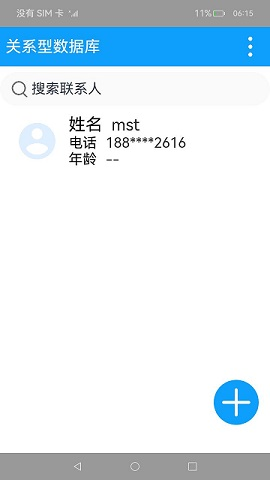
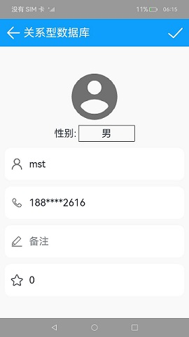
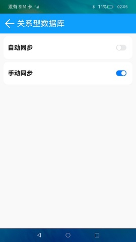

# 分布式关系型数据库

### 介绍

本示例使用[@ohos.data.relationalStore](https://gitee.com/openharmony/docs/blob/master/zh-cn/application-dev/reference/apis-arkdata/js-apis-data-relationalStore.md) 接口和[@ohos.distributedDeviceManager](https://gitee.com/openharmony/docs/blob/master/zh-cn/application-dev/reference/apis-distributedservice-kit/js-apis-distributedDeviceManager.md) 接口展示了在eTS中分布式关系型数据库的使用，在增、删、改、查的基本操作外，还包括分布式数据库的数据同步功能。

### 效果预览
| 首页                                     | 编辑联系人                                  |设置| 数据同步                                   |
|----------------------------------------|----------------------------------------|-------|----------------------------------------|
|  |  ||  |

使用说明:
1. 启动应用后点击“**+**”按钮可以添加联系人;
2. 点击联系人可以进入编辑界面编辑联系人信息;
3. 长按联系人进入多选状态，底部有“**全选**”、“**取消**”、“**删除**”、“**退出**”按钮，点击退出可以退出多选状态;
4. 点击右上角更多按钮，点击“**连接设备**”，选择要同步数据的设备，连接成功后可以开始将本端数据同步到对端;
5. 点击右上角更多按钮，点击“**设置**”可以进入设置界面设置数据同步方式，包括自动同步和手动同步。

### 工程目录
```
entry/src/main/ets/
|---common
|   |---BasicDataSource.ets                     // 联系人列表懒加载数据
|   |---BottomBtn.ets                           // 
|   |---ContactItem.ets                         // 联系人
|   |---DataChangeDetailDialog                  // 联系人变更通知
|   |---DeviceDialog.ets                        // 设备列表
|   |---PopupMenu.ets                           // 设备选择
|   |---QueryItem.ets                           // 联系人详情
|   |---SearchBar.ets                           // 搜索
|   |---TitleBar.ets                            // title
|---model
|   |---Contact.ets                             // 联系人数据
|   |---LiteStore.ets                           // 轻量级数据操作
|   |---Logger.ts                               // 日志工具
|   |---RdbConst.ets                            // 数据库参数常量集
|   |---RdbModel.ets                            // 分布式工具
|   |---RemoteDeviceModel.ets                   // 分布式设备管理
|---pages
|   |---ContactEdit.ets                         // 编辑联系人
|   |---Index.ets                               // 首页
|   |---SearchPage.ets                          // 搜索设备
|   |---Settings.ets                            // 设置
```
### 具体实现
+ 数据库的增、删、改、查操作都在RdbModel中，源码参考[RdbModel.ets](entry/src/main/ets/model/RdbModel.ets):
    + 数据库操作：使用[@ohos.data.relationalStore](https://gitee.com/openharmony/docs/blob/master/zh-cn/application-dev/reference/apis-arkdata/js-apis-data-relationalStore.md) 接口的getRdbStore获得一个相关的操作型关系数据库RdbStore，通过这个RdbStore调用相关接口进行增删改查，RdbStore.insert数据插入,RdbStore.delete数据删除，RdbStore.update更新数据，RdbStore.query根据条件查询数据;
    + 数据同步：RdbStore.on注册数据库观察者，使用RdbStore.obtainDistributedTableName根据本地表名获取指定远程设备的分布式表名，数据发生变动时通过RdbStore.sync同步数据，不需要用时删除指定观察者使用RdbStore.off。
+ 连接设备管理在RemoteDeviceModel中，源码参考[RemoteDeviceModel.ets](entry/src/main/ets/model/RemoteDeviceModel.ets):
    + 设备同步：设备同步数据需要[ohos.permission.DISTRIBUTED_DATASYNC](https://gitee.com/openharmony/docs/blob/master/zh-cn/application-dev/security/AccessToken/permissions-for-all.md#ohospermissiondistributed_datasync) 权限，在页面渲染前申请权限，源码参考[Index.ets](entry/src/main/ets/pages/Index.ets)，使用[@ohos.distributedDeviceManager](https://gitee.com/openharmony/docs/blob/master/zh-cn/application-dev/reference/apis-distributedservice-kit/js-apis-distributedDeviceManager.md) 接口，首先通过createDeviceManager创建设备管理器实例，然后通过getTrustedDeviceListSync同步获取所有可信设备列表；
    + 设备连接：首先通过on方法注册设备状态，例如发现设备，设备连接失败，然后通过startDeviceDiscovery方法发现周边设备，然后选择连接设备，再用[startAbility](https://gitee.com/openharmony/docs/blob/master/zh-cn/application-dev/reference/apis-ability-kit/js-apis-app-ability-common.md) 启动连接设备的应用。

### 相关权限

[ohos.permission.DISTRIBUTED_DATASYNC](https://gitee.com/openharmony/docs/blob/master/zh-cn/application-dev/security/AccessToken/permissions-for-all.md#ohospermissiondistributed_datasync)

允许系统应用获取分布式设备的认证组网能力：[ohos.permission.ACCESS_SERVICE_DM](https://gitee.com/openharmony/docs/blob/master/zh-cn/application-dev/security/AccessToken/permissions-for-system-apps.md#ohospermissionaccess_service_dm)

### 依赖

不涉及。

### 约束与限制

1. 本示例的同步功能需要两台设备组网后测试;
2. 本示例仅支持标准系统上运行，支持设备：RK3568。
3. 本示例为Stage模型，支持API12版本SDK，SDK版本号(API Version 12 Release),镜像版本号(5.0 Release)
4. 本示例需要使用DevEco Studio 版本号(4.1 Release)及以上版本才可编译运行。
5. 本示例需要使用@ohos.distributedDeviceManager系统权限的系统接口。使用Full SDK时需要手动从镜像站点获取，并在DevEco Studio中替换，具体操作可参考[替换指南](https://gitee.com/openharmony/docs/blob/master/zh-cn/application-dev/faqs/full-sdk-switch-guide.md)。

### 下载

如需单独下载本工程，执行如下命令：
```
git init
git config core.sparsecheckout true
echo code/SuperFeature/DistributedAppDev/DistributedRdb/ > .git/info/sparse-checkout
git remote add origin https://gitee.com/openharmony/applications_app_samples.git
git pull origin master
```