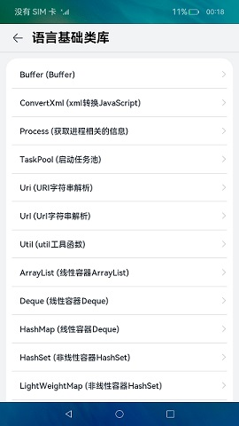
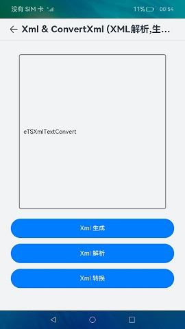

# 语言基础类库

### 介绍
本示例集合语言基础类库的各个子模块，展示了各个模块的基础功能，包含：

- [@ohos.buffer (Buffer)](https://gitee.com/openharmony/docs/blob/OpenHarmony-3.2-Release/zh-cn/application-dev/reference/apis/js-apis-buffer.md)
- [@ohos.convertxml (xml转换JavaScript)](https://gitee.com/openharmony/docs/blob/OpenHarmony-3.2-Release/zh-cn/application-dev/reference/apis/js-apis-convertxml.md)
- [@ohos.process (获取进程相关的信息)](https://gitee.com/openharmony/docs/blob/OpenHarmony-3.2-Release/zh-cn/application-dev/reference/apis/js-apis-process.md)
- [@ohos.taskpool (启动任务池)](https://gitee.com/openharmony/docs/blob/OpenHarmony-3.2-Release/zh-cn/application-dev/reference/apis/js-apis-taskpool.md)
- [@ohos.uri (URI字符串解析)](https://gitee.com/openharmony/docs/blob/OpenHarmony-3.2-Release/zh-cn/application-dev/reference/apis/js-apis-uri.md)
- [@ohos.url (URL字符串解析)](https://gitee.com/openharmony/docs/blob/OpenHarmony-3.2-Release/zh-cn/application-dev/reference/apis/js-apis-url.md)
- [@ohos.util (util工具函数)](https://gitee.com/openharmony/docs/blob/OpenHarmony-3.2-Release/zh-cn/application-dev/reference/apis/js-apis-util.md)
- [@ohos.util.ArrayList (线性容器ArrayList)](https://gitee.com/openharmony/docs/blob/OpenHarmony-3.2-Release/zh-cn/application-dev/reference/apis/js-apis-arraylist.md)
- [@ohos.util.Deque (线性容器Deque)](https://gitee.com/openharmony/docs/blob/OpenHarmony-3.2-Release/zh-cn/application-dev/reference/apis/js-apis-deque.md)
- [@ohos.util.HashMap (非线性容器HashMap)](https://gitee.com/openharmony/docs/blob/OpenHarmony-3.2-Release/zh-cn/application-dev/reference/apis/js-apis-hashmap.md)
- [@ohos.util.HashSet (非线性容器HashSet)](https://gitee.com/openharmony/docs/blob/OpenHarmony-3.2-Release/zh-cn/application-dev/reference/apis/js-apis-hashset.md)
- [@ohos.util.LightWeightMap (非线性容器LightWeightMap)](https://gitee.com/openharmony/docs/blob/OpenHarmony-3.2-Release/zh-cn/application-dev/reference/apis/js-apis-lightweightmap.md)
- [@ohos.util.LightWeightSet (非线性容器LightWeightSet)](https://gitee.com/openharmony/docs/blob/OpenHarmony-3.2-Release/zh-cn/application-dev/reference/apis/js-apis-lightweightset.md)
- [@ohos.util.LinkedList (线性容器LinkedList)](https://gitee.com/openharmony/docs/blob/OpenHarmony-3.2-Release/zh-cn/application-dev/reference/apis/js-apis-linkedlist.md)
- [@ohos.util.List (线性容器List)](https://gitee.com/openharmony/docs/blob/OpenHarmony-3.2-Release/zh-cn/application-dev/reference/apis/js-apis-list.md)
- [@ohos.util.PlainArray (非线性容器PlainArray)](https://gitee.com/openharmony/docs/blob/OpenHarmony-3.2-Release/zh-cn/application-dev/reference/apis/js-apis-plainarray.md)
- [@ohos.util.Queue (线性容器Queue)](https://gitee.com/openharmony/docs/blob/OpenHarmony-3.2-Release/zh-cn/application-dev/reference/apis/js-apis-queue.md)
- [@ohos.util.Stack (线性容器Stack)](https://gitee.com/openharmony/docs/blob/OpenHarmony-3.2-Release/zh-cn/application-dev/reference/apis/js-apis-stack.md)
- [@ohos.util.TreeMap (非线性容器TreeMap)](https://gitee.com/openharmony/docs/blob/OpenHarmony-3.2-Release/zh-cn/application-dev/reference/apis/js-apis-treemap.md)
- [@ohos.util.TreeSet (非线性容器TreeSet)](https://gitee.com/openharmony/docs/blob/OpenHarmony-3.2-Release/zh-cn/application-dev/reference/apis/js-apis-treeset.md)
- [@ohos.util.Vector (线性容器Vector)](https://gitee.com/openharmony/docs/blob/OpenHarmony-3.2-Release/zh-cn/application-dev/reference/apis/js-apis-vector.md)
- [@ohos.xml (xml解析与生成)](https://gitee.com/openharmony/docs/blob/OpenHarmony-3.2-Release/zh-cn/application-dev/reference/apis/js-apis-xml.md)

### 效果预览

|                   **主页**                |             **Util**             |                 ConvertXml                 |
| :---------------------------------------: | :---------------------------------------: | :--------------------------------------: |
|        |  |  |

使用说明

1. 首页展示语言基础类库各个子模块菜单，点击进入对应的模块页面。
2. 各个子模块界面中点击功能按钮完成各个功能。
3. Util中有二级菜单，点击进入对应的二级界面，包含：
   * StringCode：字符串编解码，点击功能按钮完成各个功能。
   * RationnalNumber：有理数比较，点击功能按钮完成各个功能。
   * LRUCache：LRU缓冲区，点击功能按钮完成各个功能。
   * ScopeHelper：范围判断，点击功能按钮完成各个功能。
   * Base64Helper：Base64编解码，点击功能按钮完成各个功能。
   * TypeCheck：类型检查，点击功能按钮完成各个功能。
4. Process界面中，先安装[ProcessMessage](lib/ProcessMessage-1.0.0.hap)，点击按钮跳转，点击功能按钮实现获取进程相关信息的功能。
5. TaskPool界面中，点击Execute task执行任务，点击Cancel task取消任务。
6. ArrayList界面中，点击+号添加数据后展示数据，点击删除按钮删除对应的一条数据。
7. Deque界面中，点击+号添加数据后展示数据，点击删除按钮删除对应的一条数据。
8. HashMap界面中，点击+号添加数据后展示数据，点击删除按钮删除对应的一条数据。
9. HashSet界面中，点击+号添加数据后展示数据，点击删除按钮删除对应的一条数据。
10. LightWeightMap界面中，点击+号添加数据后展示数据，点击删除按钮删除对应的一条数据。
11. LightWeightSet界面中，点击+号添加数据后展示数据，点击删除按钮删除对应的一条数据。
12. LinkedList界面中，点击+号添加数据后展示数据，点击删除按钮删除对应的一条数据。
13. List界面中，点击+号添加数据后展示数据，点击删除按钮删除对应的一条数据。
14. PlainArray界面中，点击+号添加数据后展示数据，点击删除按钮删除对应的一条数据。
15. Queue界面中，点击+号添加数据后展示数据，点击删除按钮删除对应的一条数据。
16. Stack界面中，点击+号添加数据后展示数据，点击删除按钮删除对应的一条数据。
17. TreeMap界面中，点击+号添加数据后展示数据，点击删除按钮删除对应的一条数据。
18. TreeSet界面中，点击+号添加数据后展示数据，点击删除按钮删除对应的一条数据。
19. Vector界面中，点击+号添加数据后展示数据，点击删除按钮删除对应的一条数据。

### 工程目录

```
LanguageBaseClassLibrary
├── AppScope                                    
│   └── app.json5                               //APP信息配置文件
├── entry/src/main                              //语言基础类库应用首页
│   ├── ets
│   │   ├── entryability
│   │   ├── pages
│   │   │   ├── Index.ets                       //主页入口
│   │   │   ├── AddInformationView.ets          //添加联系人页面
│   │   │   ├── AddKeyValuePairView.ets         //添加Key/Value页面
│   │   │   ├── AddStringView.ets               //添加String页面
│   │   │   ├── compnents                       
│   │   │   │   └── Capabilities.ets            //根据点击的菜单，展示对应的子界面
│   └── module.json5
│ 
├── common/src/main                             //公共组件及工具类
│   ├── ets
│   │   ├── components
│   │   │   └── CustomDataSource.ets            //自定义DataSource，LazyForEach时使用
│   │   ├── util
│   │   │   ├── Logger.ets                      //日志工具类
│   │   │   └── ResourceUtil.ets                //资源管理工具类
│   └── module.json5
│
├── menuitems/src/main                          //菜单
│   ├── ets
│   │   ├── Index.ets                           //对外提供的接口列表
│   │   ├── menulist                            //菜单组件
│   │   │    └── MenuList.ets                  
│   │   ├── components                          //菜单相关自定义组件
│   └── module.json5
│
├── capabilities/src/main                       //功能集
│   ├── ets
│   │   ├── capabilities                        //各个子模块功能组件
│   │   ├── components                          //子模块相关组件
│   │   │   ├── arraylistcomponents             //arraylist相关组件
│   │   │   ├── dequecomponents                 //deque相关组件
│   │   │   ├── hashmapcomponents               //hashmap相关组件
│   │   │   ├── hashsetcomponents               //hashset相关组件
│   │   │   ├── lightweightmapcomponents        //lightweightmap相关组件
│   │   │   ├── lightweightsetcomponents        //lightweightset相关组件
│   │   │   ├── linkedlistcomponents            //linkedlist相关组件
│   │   │   ├── listcomponents                  //list相关组件
│   │   │   ├── plainarraycomponents            //plainarray相关组件
│   │   │   ├── queuecomponents                 //queue相关组件
│   │   │   ├── stackcomponents                 //stack相关组件
│   │   │   ├── treemapcomponents               //treemap相关组件
│   │   │   ├── treesetcomponents               //treeset相关组件
│   │   │   ├── utilcomponents                  //util相关组件
│   │   │   ├── vectorcomponents                //vector相关组件
│   │   │   ├── ColumnOperation.ets             //展示一列功能按钮的组件
│   │   │   ├── DeleteView.ets                  //删除按钮的组件
│   │   │   ├── GridOperation.ets               //根据窗口大小展示不同列的功能按钮的组件
│   │   │   ├── InformationItemView.ets         //联系人Item的组件
│   │   │   ├── KeyValueItemView.ets            //Key/Value Item的组件
│   │   │   └── ValueItemView.ets               //Value Item的组件
│   │   ├── model                               //相关数据模型
│   │   ├── utils                               //相关工具类
│   │   └── Constant.ts                         //EmitterId
│   └── module.json5
```

### 具体实现

1. 首页菜单展示：使用一个module，menuitems完成菜单组件的实现，传入要展示的菜单的strarray类型的资源和菜单点击对应的组件即可。使用Navigation和NavRouter组件实现菜单点击进入功能界面，使用LocalStorage实现应用内Ability内数据共享，点击菜单时标记selectedLabel，在entry中的Capabilities组件中，通过selectedLabel显示对应的功能组件。
2. Xml & ConvertXml：使用[xml](https://gitee.com/openharmony/docs/blob/OpenHarmony-3.2-Release/zh-cn/application-dev/reference/apis/js-apis-xml.md) 和[convertxml](https://gitee.com/openharmony/docs/blob/OpenHarmony-3.2-Release/zh-cn/application-dev/reference/apis/js-apis-convertxml.md) 实现xml的解析和生成以及xml转换为js对象，点击按钮实现对应的功能。
3. Process：使用[process](https://gitee.com/openharmony/docs/blob/OpenHarmony-3.2-Release/zh-cn/application-dev/reference/apis/js-apis-process.md) 实现获取进程相关信息的功能，点击按钮实现对应的功能。
4. TaskPool：使用[taskpool](https://docs.openharmony.cn/pages/v3.2/zh-cn/application-dev/reference/apis/js-apis-taskpool.md/) 实现创建后台任务（Task），并对所创建的任务进行如任务执行、任务取消的操作。
5. Url：使用[URL](https://gitee.com/openharmony/docs/blob/OpenHarmony-3.2-Release/zh-cn/application-dev/reference/apis/js-apis-url.md) 对URL字符串的查找参数进行了增删改查的一系列操作，使得读者对URL的结构用途更加明了，点击按钮实现对应的功能。
6. Util，使用util中不同的功能函数实现以下功能：
   * StringCode：字符串编解码。
   * RationnalNumber：有理数比较。
   * LRUCache：LRU缓冲区。
   * ScopeHelper：范围判断。
   * Base64Helper：Base64编解码。
   * TypeCheck：类型检查。
7. ArrayList：展示线性容器ArrayList的数据类型的使用，包括添加、删除。
8. Deque：展示线性容器Deque的数据类型的使用，包括头部插入、头部删除、尾部删除。
9. HashMap：展示非线性容器HashMap的数据类型的使用，包括添加键值对、删除键值对。
10. HashSet：展示非线性容器HashSet的数据类型的使用，包括添加、删除。
11. LightWeightMap：展示非线性容器LightWeightMap的数据类型的使用，包括添加键值对、删除键值对。
12. LightWeightSet：展示非线性容器LightWeightSet的数据类型的使用，包括添加、删除。
13. LinkedList：展示线性容器LinkedList的数据类型的使用，包括尾部添加、头部删除、尾部删除。
14. List：展示线性容器List的数据类型的使用，包括添加、删除。
15. PlainArray：展示非线性容器PlainArray的数据类型的使用，包括添加、删除。
16. Queue：展示线性容器Queue的数据类型的使用，包括尾部添加、头部删除。
17. Stack：展示线性容器Stack的数据类型的使用，包括尾部添加、尾部删除。
18. TreeMap：展示非线性容器TreeMap的数据类型的使用，包括添加键值对、删除键值对。
19. TreeSet：展示非线性容器TreeSet的数据类型的使用，包括添加、删除。
20. Vector：展示线性容器Vector的数据类型的使用，包括添加、删除。

### 相关权限

不涉及。

### 依赖

不涉及。

### 约束与限制

1. 本示例仅支持标准系统上运行。

2. 本示例支持API10版本SDK，SDK版本号(API Version 10 Release),镜像版本号(4.0 Release)。

3. 本示例需要使用DevEco Studio 版本号(4.0 Release)及以上版本才可编译运行。

###  下载

如需单独下载本工程，执行如下命令：

```
git init
git config core.sparsecheckout true
echo code/LaunguageBaseClassLibrary/LanguageBaseClassLibrary/ > .git/info/sparse-checkout
git remote add origin https://gitee.com/openharmony/applications_app_samples.git
git pull origin master
```