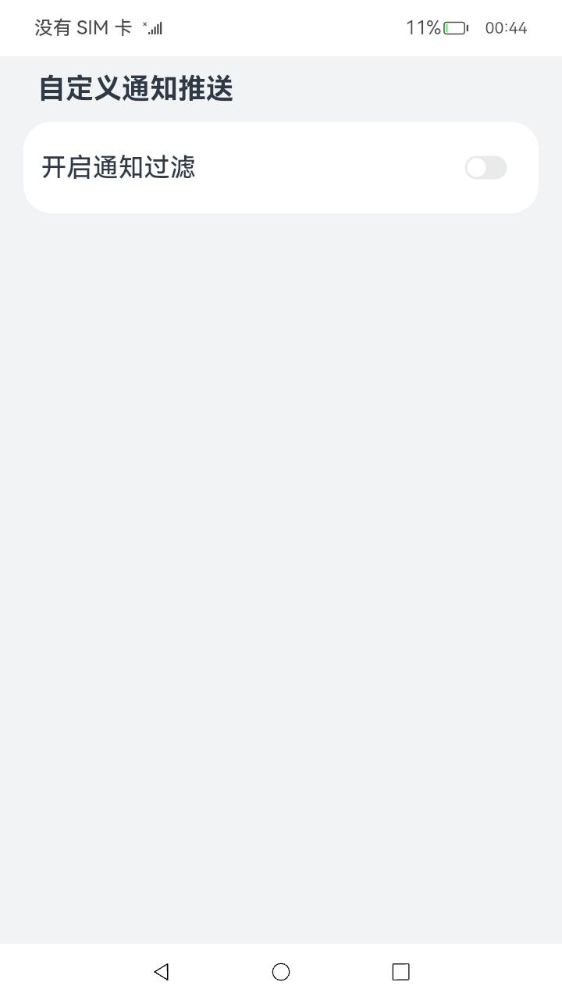
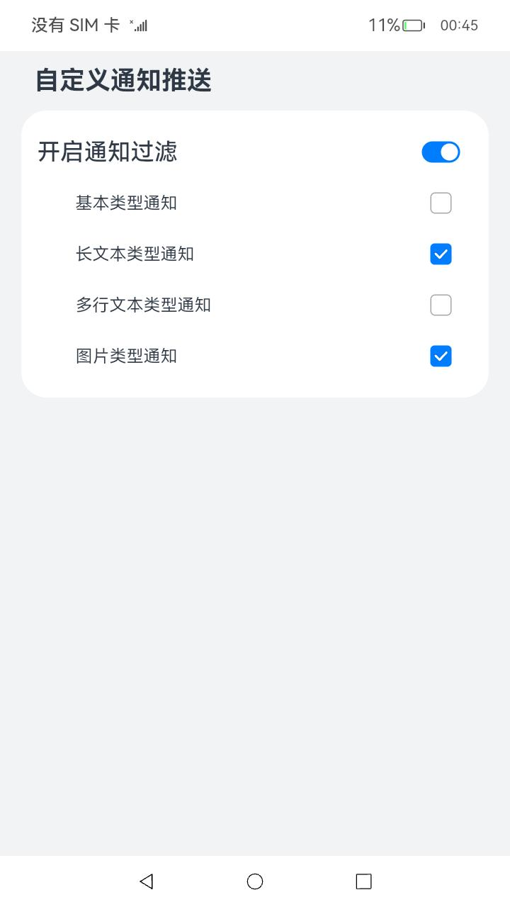

# 自定义通知推送

### 介绍

本示例主要展示了通知过滤回调管理的功能，使用[@ohos.notificationManager](https://gitee.com/openharmony/docs/blob/master/zh-cn/application-dev/reference/apis-notification-kit/js-apis-notificationManager-sys.md)
接口，进行通知监听回调，决定应用通知是否发送。

### 效果预览

| 通知过滤关闭                               | 通知过滤开启                              |
|--------------------------------------|-------------------------------------|
|  |  |

使用说明

1. 在使用本应用时，需安装[自定义通知角标应用](https://gitee.com/openharmony/applications_app_samples/tree/master/code/BasicFeature/Notification/CustomNotificationBadge)；
2. 在主界面，进行通知过滤的开启及关闭；
3. 开启通知过滤后，可以选择允许通知的类型，去勾选后，相应类型的通知将不会发送出现通知栏；
4. 打开自定义通知角标应用应用，进行通知的发送，查看是否发送成功；
5. 发送通知的应用必须为普通应用才能进行通知过滤，系统应用默认所有通知都能发送。

### 工程目录

```
entry/src/main/ets/
|---feature
|   |---NotificationFilterUtil.ets           // 对外提供通知过滤的接口
|---entryability
|---pages
|   |---Index.ets                            // 首页
|---util
|   |---Logger.ets                           // 日志工具
```

### 具体实现

* 允许通知过滤、指定通知类型过滤的功能接口封装在NotificationFilterUtil，源码参考：[NotificationFilterUtil.ets](entry/src/main/ets/feature/NotificationFilterUtil.ets)
    * 允许通知过滤：在[Index.ets](entry/src/main/ets/pages/Index.ets)
      页面中通过Toggle状态改变事件调用setNotificationEnableFilter()接口开启通知监听并设置通知过滤回调管理；
    * 指定类型通知过滤：在[Index.ets](entry/src/main/ets/pages/Index.ets)
      页面中，开启通知过滤后，勾选或取消勾选指定通知类型调用接口setContentTypeEnable()接口设置通知类型是否允许发送；

### 相关权限
[ohos.permission.NOTIFICATION_CONTROLLER](https://gitee.com/openharmony/docs/blob/master/zh-cn/application-dev/security/AccessToken/permissions-for-system-apps.md#ohospermissionnotification_controller)

[ohos.permission.NOTIFICATION_AGENT_CONTROLLER](https://gitee.com/openharmony/docs/blob/master/zh-cn/application-dev/security/AccessToken/permissions-for-system-apps.md#ohospermissionnotification_agent_controller)

### 依赖

通知发送依赖于[自定义通知角标应用](https://gitee.com/openharmony/applications_app_samples/tree/master/code/BasicFeature/Notification/CustomNotificationBadge)，
进行不同类型通知的发送测试。

### 约束与限制

1. 本示例仅支持标准系统上运行，支持设备：RK3568;
2. 本示例仅支持API10版本SDK，SDK版本号(API Version 10 Release),镜像版本号(4.0Release)。
3. 本示例需要使用DevEco Studio 版本号(4.0Release)及以上版本才可编译运行。
4. 本示例涉及系统接口，需要配置系统应用签名，可以参考[特殊权限配置方法](https://gitee.com/openharmony/docs/blob/master/zh-cn/application-dev/security/hapsigntool-overview.md) ，把配置文件中的“app-feature”字段信息改为“hos_system_app”,"apl"字段修改为“system_core”。

### 下载

如需单独下载本工程，执行如下命令：

```
git init
git config core.sparsecheckout true
echo code/SystemFeature/Notification/CustomNotificationPush/ > .git/info/sparse-checkout
git remote add origin https://gitee.com/openharmony/applications_app_samples.git
git pull origin master
```