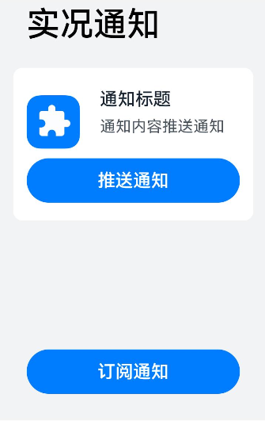
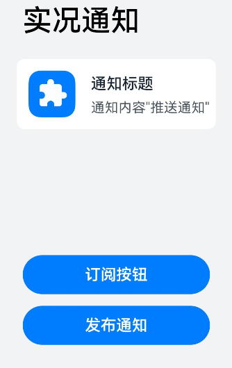
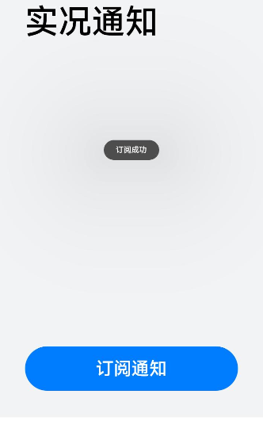
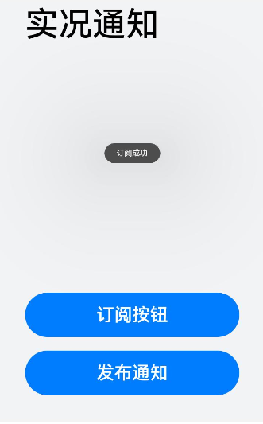
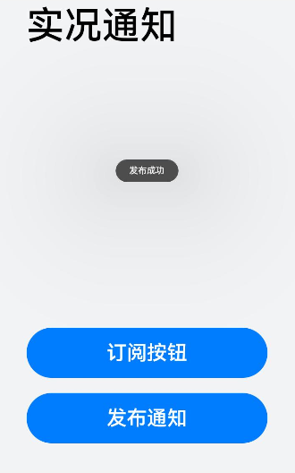

# 实况通知推送

### 介绍

本示例主要展示了通知发布订阅的功能，使用[notificationSubscribe.subscribe](https://gitee.com/openharmony/docs/blob/master/zh-cn/application-dev/reference/apis-notification-kit/js-apis-notificationSubscribe-sys.md)
等接口，实现订阅、发布、推送通知等功能。

### 效果预览

| 订阅通知（订阅包）                          | 发布通知订阅按钮（发布包）                     | 订阅回调（订阅包）                                       | 发布回调（发布包）                                      | 订阅通知成功(订阅包)                                | 订阅按钮成功（发布包）                                  | 允许弹窗（发布包）                       | 发布通知成功（发布包）                              |
|------------------------------------|-----------------------------------|--------------------------------------------|-------------------------------------------|--------------------------------------------|----------------------------------------------|---------------------------------|------------------------------------------|
|  |  |  |  |  |  |  |  |

使用说明

1.先启动订阅包，点击订阅通知，订阅成功时会弹出订阅成功弹窗（必须先订阅）；

2.启动发布包，点击订阅按钮，订阅成功时会弹出订阅成功弹窗。点击发布通知按钮，点击会出现是否允许发送通知弹窗，点击允许，发布成功时会弹出发布成功弹窗；

3.回到订阅包，此时会展示发布的内容，其中有一个推送通知button（发布包里订阅button订阅的button），点击推送通知button，推送成功时会弹出推送成功弹窗；

4.切到发布包，此时会展示推送内容；

5.两个包都要签名为系统应用；

### 工程目录

```
entry/src/main/ets/
|---entryability
|---pages
|   |---Index.ets                            // 首页
entry/src/ohosTest/ets/
|---test
|   |---Ability.test.ets                       // 首页的自动化测试    
```

### 具体实现

* 订阅发布包：调用notificationSubscribe接口实现订阅功能；
* 订阅推送button： 调用subscribeSystemLiveView接口实现订阅button功能；
* 发布通知： 调用notificationManager.publish接口实现发布功能；
* 推送通知： 调用triggerSystemLiveView接口实现推送功能；
* 获取发布消息权限： 调用requestEnableNotificationw获取发布消息权限；

### 相关权限

[ohos.permission.NOTIFICATION_CONTROLLER](https://gitee.com/openharmony/docs/blob/master/zh-cn/application-dev/security/AccessToken/permissions-for-system-apps.md#ohospermissionnotification_controller)

### 依赖

通知发布要安装[发布应用](../Publish)，
进行发布订阅的测试。

### 约束与限制

1. 本示例仅支持标准系统上运行，支持设备：RK3568;
2. 本示例为stage模型，仅适配API version11版本SDK，SDK版本号(API Version 11 Release)。
3. 本示例需要使用DevEco Studio 版本号(3.1.1 Release)版本才可编译运行。

本示例涉及系统接口，需要配置系统应用签名，可以参考[特殊权限配置方法](https://docs.openharmony.cn/pages/v3.2Beta/zh-cn/application-dev/security/hapsigntool-overview.md/)
，把配置文件中的“app-feature”字段信息改为“hos_system_app”,"apl"字段修改为“system_basic”。

### 下载

如需单独下载本工程，执行如下命令：

```
git init
git config core.sparsecheckout true
echo code/SystemFeature/Notification/Subscribe/ > .git/info/sparse-checkout
git remote add origin https://gitee.com/openharmony/applications_app_samples.git
git pull origin ***(分支名)
```