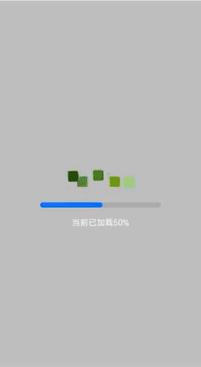

# 页面加载效果实现案例

### 介绍

本示例介绍Stack堆叠组件和LoadingProgress加载组件模拟首次进入页面实现页面加载的效果。加载完成后，LoadingProgress组件会消失并展示加载结果页（即商品页）。

### 效果图预览



**使用说明**

1. 进入页面开始加载，加载完成后显示整个界面。

### 实现思路

1. 为了实现在页面初次加载时即展现出加载提示效果，预先定义了一个布尔类型的变量isLoading，并将其初始值设定为true。在页面加载初期，这一变量状态将触发加载页的显现，传达数据正在加载的即时信息。
```javascript
build() {
  Stack() {
    if (this.isLoading) {
      // 加载页
      LoadingHUD();
    } else {
      // 商品页
      CommodityList();
    }
  }
  .width('100%')
  .height('100%')
  .backgroundColor(Color.White)
}
```
2. 使用Canvas播放lottie动画以及Progress组件实现进度条
```javascript
Canvas(this.politeChickyController)
  .width($r('app.integer.lottie_view_canvas_size'))
  .height($r('app.integer.lottie_view_canvas_size'))
  .borderRadius($r('app.string.ohos_id_corner_radius_default_m'))
  .onReady(() => {
    // TODO:知识点:必须要Canvas组件初始化之后才能执行lottie.loadAnimation方法去加载动画。
    this.initAnimation();
  })
Row() {
  Progress({ value: this.nowProgress, total: 100, type: ProgressType.Linear })
    .style({ strokeWidth: 10, enableSmoothEffect: true })
    .color(this.gradientColor)
}
.width('60%')
.margin({ top: $r('app.integer.lottie_view_canvas_height') })
```
3. 为了模拟真实的网络加载情景，设置了5秒的延迟加载机制。在页面初次加载后的5秒钟内，isLoading变量保持为true，保持加载页的展示。当5秒时限到达时，将isLoading变量的值更新为false，代表加载状态的loadingHUD将会消失，真正的加载结果CommodityList商品列表页面便会呈现出来。
```javascript
aboutToAppear(): void { 
  // 模拟网络请求操作，请求网络3秒后得到数据，通知组件，变更列表数据
  setTimeout(() => {
    this.isLoading = false;
  }, MILLISECONDS);
}
```
4. CommodityList商品列表页面采用[RelativeContainer](pageloading/src/main/ets/view/CommodityList.ets)相对布局组件，容器内子组件区分水平方向，垂直方向，子组件可以将容器或者其他子组件设为锚点。
```javascript
RelativeContainer() {
  // 商品图片
  Image(item.uri)
    ...
  .alignRules({
    top: { anchor: '__container__', align: VerticalAlign.Top },
    left: { anchor: '__container__', align: HorizontalAlign.Start }
  })
  .id('image')
  // 保价标签
  Text(item.insurance)
    ...
  .alignRules({
    right: { anchor: '__container__', align: HorizontalAlign.End },
    center: { anchor: '__container__', align: VerticalAlign.Center }
  })
  .id('insurance')
  // 浏览量
  Row() {
    Image($r('app.media.page_loading_views'))
      ...
    Text(item.views)
      ...
  }
  .alignRules({
    middle: { anchor: 'insurance', align: HorizontalAlign.Center },
    top: { anchor: 'insurance', align: VerticalAlign.Bottom }
  })
  .id('views')
  // 标题和价格标签
  Column() {
    Text(item.title)
      ...
    Text(item.price)
      ...
  }
  .alignRules({
    left: { anchor: 'image', align: HorizontalAlign.End },
    right: { anchor: 'insurance', align: HorizontalAlign.Start },
    center: { anchor: 'image', align: VerticalAlign.Center }
  })
  .id('column')
}

```

### 高性能知识点

本示例使用了[LazyForEach](https://gitee.com/openharmony/docs/blob/master/zh-cn/application-dev/reference/apis-arkui/arkui-ts/ts-rendering-control-lazyforeach.md)进行数据懒加载，LazyForEach懒加载可以通过设置cachedCount属性来指定缓存数量，同时搭配[组件复用](https://gitee.com/openharmony/docs/blob/master/zh-cn/application-dev/performance/component-reuse-overview.md)能力以达到性能最优效果。

### 工程结构&模块类型

```
pageloading                                      // har类型
|---mock
|   |---CommodityMock.ets                        // 本地数据源 
|---model
|   |---CommodityDataModel.ets                   // 数据类型定义
|   |---CommodityDataSource.ets                  // 列表数据模型 
|---view
|   |---CommodityList.ets                        // 商品列表自定义组件 
|   |---LoadingHUD.ets                           // 加载自定义组件 
|   |---PageLoading.ets                          // 主页面
```

### 模块依赖

不涉及

### 参考资料

[Stack](https://gitee.com/openharmony/docs/blob/master/zh-cn/application-dev/reference/apis-arkui/arkui-ts/ts-container-stack.md)

[Progress](https://gitee.com/openharmony/docs/blob/master/zh-cn/application-dev/reference/apis-arkui/arkui-ts/ts-basic-components-progress.md)

[RelativeContainer](https://gitee.com/openharmony/docs/blob/master/zh-cn/application-dev/reference/apis-arkui/arkui-ts/ts-container-relativecontainer.md)

### 相关权限

不涉及

### 约束与限制

1.本示例仅支持在标准系统上运行，支持设备：RK3568。

2.本示例为Stage模型，支持API12版本SDK，SDK版本号（API Version 12 Release）。

3.本示例需要使用DevEco Studio 5.0.0 Release 才可编译运行。

### 下载

如需单独下载本工程，执行如下命令：
```javascript
git init
git config core.sparsecheckout true
echo code/UI/PageLoading/ > .git/info/sparse-checkout
git remote add origin https://gitee.com/openharmony/applications_app_samples.git
git pull origin master
```


