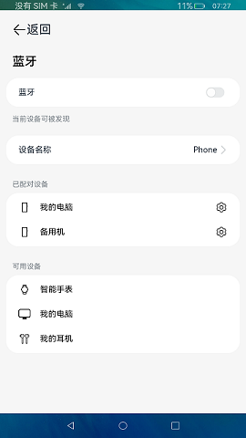

# 窗口扩展应用（仅对系统应用开放）

### 介绍

本示例仿设置应用，实现点击设置菜单栏，跳转或加载详情页面。

本示例通过 [窗口扩展能力](https://gitee.com/openharmony/docs/blob/master/zh-cn/application-dev/reference/apis-arkui/js-apis-application-windowExtensionAbility-sys.md) 设置不同Ability，使用 [AbilityComponent](https://gitee.com/openharmony/docs/blob/master/zh-cn/application-dev/reference/apis-arkui/arkui-ts/ts-container-ability-component-sys.md) 组件加载各个Ability。

### 效果预览

|主页| WLAN页面                              | 蓝牙页面                                     | 移动数据页面                                    |
|--------------------------------|-------------------------------------|------------------------------------------|-------------------------------------------|
| |  |  |  |

使用说明：

1.竖屏模式下点击左侧设置菜单栏，跳转详情页面。

2.横屏模式下点击左侧设置菜单栏，右侧显示详情页面。

### 工程目录
```
entry/src/main/ets/
|---Application
|   |---MyAbilityStage.ts                    
|---feature
|   |---Logger.ts                           // 日志工具
|   |---Rpc.ts                              // 进程通信
|---MainAbility
|   |---BluetoothExtAbility.ts
|   |---MainAbility.ts
|   |---MobileDataExtAbility.ts
|   |---WlanExtAbility.ts
|---mock
|   |---InfoData.ts                         // 数据类型
|---pages
|   |---common
|   |   |---Common.ets                      // 全局通用组件
|   |---Index.ets                           // 首页
|   |---Bluetooth.ets                       // 蓝牙
|   |---MobileData.ets                      // 移动数据
|   |---Wlan.ets                            // Wlan
```
### 具体实现

* 本示例通过窗口扩展能力设置不同Ability，使用AbilityComponent组件加载各个Ability，matchMediaSync方法设置媒体查询的查询条件，RemoteObject方法实现远程对象。
* 源码链接：[WlanExtAbility.ts](entry/src/main/ets/MainAbility/WlanExtAbility.ts)，[BluetoothExtAbility.ts](entry/src/main/ets/MainAbility/BluetoothExtAbility.ts)，[MobileDataExtAbility.ts](entry/src/main/ets/MainAbility/MobileDataExtAbility.ts)，[Rpc.ts](entry/src/main/ets/feature/Rpc.ts)
* 接口参考：[@ohos.application.WindowExtensionAbility](https://gitee.com/openharmony/docs/blob/master/zh-cn/application-dev/reference/apis-arkui/js-apis-application-windowExtensionAbility-sys.md)，[AbilityComponent](https://gitee.com/openharmony/docs/blob/master/zh-cn/application-dev/reference/apis-arkui/arkui-ts/ts-container-ability-component-sys.md)，[@ohos.rpc](https://gitee.com/openharmony/docs/blob/master/zh-cn/application-dev/reference/apis-ipc-kit/js-apis-rpc.md)，[@ohos.mediaquery](https://gitee.com/openharmony/docs/blob/master/zh-cn/application-dev/reference/apis-arkui/js-apis-mediaquery.md)

### 相关权限

不涉及。

### 依赖

不涉及。

### 约束与限制

1.本示例仅支持标准系统上运行，支持设备：支持RK3568。

2.本示例已适配API version 9版本SDK，版本号：3.2.11.9。

3.本示例需要使用DevEco Studio 3.1 Beta2 (Build Version: 3.1.0.400, built on April 7, 2023)及以上版本才可编译运行。

4.本示例使用的WindowExtensionAbility、AbilityComponent均为系统接口，需要使用Full SDK手动从镜像站点获取，并在DevEco Studio中替换，具体操作可参考[替换指南](https://gitee.com/openharmony/docs/blob/master/zh-cn/application-dev/faqs/full-sdk-switch-guide.md)。

### 下载

如需单独下载本工程，执行如下命令：
```
git init
git config core.sparsecheckout true
echo code/SystemFeature/WindowManageMent/WindowExtAbility/ > .git/info/sparse-checkout
git remote add origin https://gitee.com/openharmony/applications_app_samples.git
git pull origin master

```