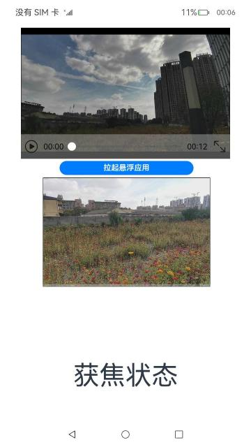

# 窗口

### 介绍

本示例展示了

1.在应用主窗口中创建和拉起子窗口，并对子窗口设置窗口相关属性，以及设置窗口规避区域、窗口沉浸式和小窗口等功能。

2.在应用中获取系统栏的属性。

3.在应用中设置窗口可触摸区域。

本示例使用[窗口管理](https://gitee.com/openharmony/docs/blob/master/zh-cn/application-dev/reference/apis-arkui/js-apis-window.md)。

### 效果预览

| 主页                                                              | 窗口视频                                                                          | 拉起悬浮应用                                                |
|-----------------------------------------------------------------|-------------------------------------------------------------------------------|-------------------------------------------------------|
|         |                    |  |
| 设置可触摸区域                                                     | 获取系统栏属性                                                                |
|  |     |

窗口视频-使用说明：

1.启动应用，点击窗口视频跳转到播放页。

2.点击视频屏幕可以拉起小窗口播放视频，小窗口可以拖拽，再次点击视频可以关闭小窗口。

3.点击全屏播放并切换窗口方向按钮可以全屏播放视频并且改变窗口方向。

4.点击视频屏幕拉起小窗口播放视频， 界面显示小窗口状态为“获焦状态”; 再次点击视频关闭小窗口， 界面显示小窗口状态为“失焦状态”。

5.点击视频屏幕拉起小窗口视频，再点击小窗口中的“拉起悬浮应用”按钮，成功拉起WindowRatio悬浮应用。


获取系统栏属性-使用说明：

1.启动应用，点击获取系统状态栏属性页。

2.点击获取系统状态栏属性，展示系统状态栏相关属性到页面。


设置窗口可触摸区域-使用说明：

1.启动应用，点击获取设置窗口可触摸区域页。

2.页面启动时，将窗口上25%高度区域（区域1）和最下25%高度区域（区域4）设置为可以触摸区域，其它区域不可触摸。

3.可以点击区域1和区域4可以触发点击事件并使用ShowToast显示点击的区域信息，其它区域则无法触发事件。

### 工程目录

```
entry/src/main/ets/
|---Application
|   |---MyAbilityStage.ts                   
|---MainAbility
|   |---MainAbility.ts                    
|---pages
|   |---Index.ets                      // 首页
|   |---SubWindowPage.ets              // 全屏播放
|   |---Video.ets                      // 视频播放
|---system_bar
|   |---pages
|   |   |---GetPropertiesOfSystemBar.ets //获取系统状态栏属性
|---touchable
|   |---pages
|   |   |---SetTouchableAreas.ets       //设置可触摸区域
|---utils
|   |---Logger.ets                      //日志工具类
```

### 具体实现

* 本示例主要分为五个模块
    * 首页入口模块
        * 使用WindowStage实例化一个窗口，引入WindowManger方法设置一个主窗口与子窗口
        * 源码链接：[WindowManger.ts](WindowComponent/src/main/ets/components/feature/WindowManger.ts)，[WindowConst.ts](WindowComponent/src/main/ets/components/util/WindowConst.ts)
        * 参考接口：[@ohos.window](https://gitee.com/openharmony/docs/blob/master/zh-cn/application-dev/reference/apis-arkui/js-apis-window.md)，[@ohos.events.emitter](https://gitee.com/openharmony/docs/blob/master/zh-cn/application-dev/reference/apis-basic-services-kit/js-apis-emitter.md)，[@ohos.app.ability.common](https://gitee.com/openharmony/docs/blob/master/zh-cn/application-dev/reference/apis-ability-kit/js-apis-app-ability-common.md)，[@ohos.router](https://gitee.com/openharmony/docs/blob/master/zh-cn/application-dev/reference/apis-arkui/js-apis-router.md)

    * 窗口视频模块
        * 这里用到依赖window-components中WindowComponent方法来进行视频的播放

    * 全屏播放窗口并切换窗口方向模块
        * 通过EventPriority方法表示事件被发送的优先级，emitter.emit方法发送指定的事件进行全屏播放和切换窗口方向
        * 参考接口：[@ohos.events.emitter](https://gitee.com/openharmony/docs/blob/master/zh-cn/application-dev/reference/apis-basic-services-kit/js-apis-emitter.md)
    
    * 获取系统状态栏属性页
        * 通过Button触发当前window.getWindowSystemBarProperties()方法，通过Text组件展示到界面
        * 参考接口：[@ohos.window](https://gitee.com/openharmony/docs/blob/master/zh-cn/application-dev/reference/apis-arkui/js-apis-window.md)

    * 设置窗口可触摸区域页
        * 通过window.setTouchableAreas(rects： Array<Rect>)方法，设置窗口内的可触摸区域，通过4个区域内的Text组件的点击事件触发，来展示对窗口触摸区域的限制
        * 参考接口：[@ohos.window](https://gitee.com/openharmony/docs/blob/master/zh-cn/application-dev/reference/apis-arkui/js-apis-window.md)
### 相关权限

本示例需要在module.json5中配置如下权限：

允许应用使用悬浮窗的能力：[ohos.permission.SYSTEM_FLOAT_WINDOW](https://gitee.com/openharmony/docs/blob/master/zh-cn/application-dev/security/AccessToken/permissions-for-system-apps.md#ohospermissionsystem_float_window)

### 依赖

本示例需要依赖[窗口比例](../WindowRatio)sample，本示例点击“拉起悬浮应用”按钮之后会以悬浮窗模式拉起[窗口比例](../WindowRatio)sample。

### 约束与限制

1.本示例仅支持标准系统上运行，支持设备：RK3568。

2.本示例不支持release版本，仅支持master版本，当前software version为OpenHarmony 5.0.0.19。

3.本示例仅支持API12版本SDK，版本号：5.0.0.19，本涉及涉及使用系统接口：window.setTouchableAreas(rects： Array<Rect>): void，需要手动替换Full SDK才能编译通过，具体操作可参考[替换指南](https://gitee.com/openharmony/docs/blob/master/zh-cn/application-dev/faqs/full-sdk-switch-guide.md)。

4.本示例需要使用DevEco Studio 版本号(Build Version： 4.1.3.500， built on January 20， 2024)及以上版本才可编译运行。

5.本示例所配置的权限ohos.permission.SYSTEM_FLOAT_WINDOW为system_basic级别(相关权限级别可通过[权限定义列表](https://gitee.com/openharmony/docs/blob/master/zh-cn/application-dev/security/AccessToken/permissions-for-system-apps.md)查看)，需要手动配置对应级别的权限签名(具体操作可查看[自动化签名方案](https://docs.openharmony.cn/pages/v4.0/zh-cn/application-dev/security/hapsigntool-overview.md)。

### 下载

如需单独下载本工程，执行如下命令：

```
git init
git config core.sparsecheckout true
echo code/SystemFeature/WindowManagement/WindowManage/ > .git/info/sparse-checkout
git remote add origin https：//gitee.com/openharmony/applications_app_samples.git
git pull origin master

```