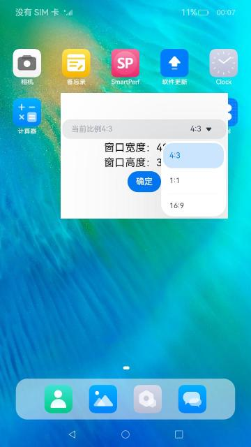

# 窗口

### 介绍

本示例主要展示了在子窗口中以悬浮窗模式拉起悬浮应用，并对新的应用设置窗口缩放比例，窗口以设置的比例进行缩放，并在界面显示窗口当前的宽度和高度。

本实例使用[@ohos.window](https://gitee.com/openharmony/docs/blob/master/zh-cn/application-dev/reference/apis-arkui/js-apis-window.md)

### 效果预览

本示例拉起悬浮应用并设置窗口比例，按照设置的窗口比例缩放窗口并监听窗口大小。效果图如下：

| 拉起悬浮应用                             | 设置窗口比例                               | 监听窗口大小                              |
| ---------------------------------------- | ------------------------------------------ | ----------------------------------------- |
|  |  |  |

使用说明

1.安装[WindowRatio](/code/SystemFeature/WindowManagement/WindowRatio)工程hap包(即本示例)和[WindowManage](/code/SystemFeature/WindowManagement/WindowManage)工程hap包

2.打开WindowManage应用sample，点击**窗口预览**进入视频播放页面，点击主窗口后拉起子窗口。

2.点击**拉起悬浮应用**按钮后，将以悬浮窗模式拉起应用WindowRatio 。

3.点击悬浮应用中的下拉框，选择窗口缩放比例，点击**确定**按钮，以新的宽度/比例计算得到窗口宽高，监听到窗口缩放比例发生变化，窗口以设置的比例改变大小，窗口监听到大小发生变化，在页面上显示当前窗口的宽度和高度。另外，窗口不具备记忆之前位置大小的能力，当前sample所调用的接口展示结果不居中，若要使得窗口居中，则需调用resize接口指定成想要的大小。

### 工程目录

```
entry/src/main/ets/
|---Application
|---MainAbility
|   |---MainAbility.ts                     // 设置窗口模式，监听窗口大小等窗口管理的文件
|---pages
|   |---index.ets                          // 首页，设置
```

### 具体实现

- 设置窗口缩放比例的功能接口封装在Index，源码参考：[Index](entry/src/main/ets/pages/index.ets)
  - 使用windows.setAspectRatio来设置窗口缩放比例;
- 设置以悬浮窗模式显示窗口和设置监听窗口大小接口的功能封装在MainAbility，源码参考：[MainAbility](entry/src/main/ets/MainAbility/MainAbility.ts)
  - 使用windows.setWindowMode来设置窗口为悬浮窗模式;
  - 使用windows.on('windowSizeChange', (data))来监听窗口大小信息；

### 相关权限

本示例需要在module.json5中配置如下权限:

允许应用使用悬浮窗的能力：[ohos.permission.SYSTEM_FLOAT_WINDOW](https://gitee.com/openharmony/docs/blob/master/zh-cn/application-dev/security/AccessToken/permissions-for-system-apps.md#ohospermissionsystem_float_window)

此外，因为本示例使用了系统能力的接口，还需在SDK/10/toolchains/lib目录下的UnsgnedReleasedProfileTemplate.json中修改以下配置权限：

```
"bundle-info":{
  ...
  "apl":"system_core",
  "app-feature":"ohos_system_app"
}
```

### 依赖

本示例需要依赖[WindowManage](/code/SystemFeature/WindowManagement/WindowManage) sample，[WindowManage](/code/SystemFeature/WindowManagement/WindowManage) sample会在子窗口中拉起本应用，然后在本应用中设置窗口缩放比例并监听本应用的窗口大小。

### 约束与限制

1.本示例仅支持在标准系统上运行，仅支持设备：RK3568。

2.本示例为Stage模型，仅支持API10版本SDK，SDK版本号(API Version 10 Release),镜像版本号(4.0Release)；本示例涉及使用系统接口：@ohos.window中的WindowMode属性，需要手动替换Full SDK才能编译通过，具体操作可参考[替换指南](https://gitee.com/openharmony/docs/blob/master/zh-cn/application-dev/faqs/full-sdk-switch-guide.md)。

3.本示例所配置的权限ohos.permission.SYSTEM_FLOAT_WINDOW为system_basic级别(相关权限级别可通过[权限定义列表](https://gitee.com/openharmony/docs/blob/master/zh-cn/application-dev/security/AccessToken/permissions-for-system-apps.md)查看)，需要手动配置对应级别的权限签名(具体操作可查看[自动化签名方案](https://docs.openharmony.cn/pages/v4.0/zh-cn/application-dev/security/hapsigntool-overview.md))。

4.本示例需要使用DevEco Studio 版本号(4.0Release)及以上版本才可编译运行。

### 下载

如需单独下载本工程，执行如下命令：
```
git init
git config core.sparsecheckout true
echo code/SystemFeature/WindowManagement/WindowRatio/ > .git/info/sparse-checkout
git remote add origin https://gitee.com/openharmony/applications_app_samples.git
git pull origin master

```