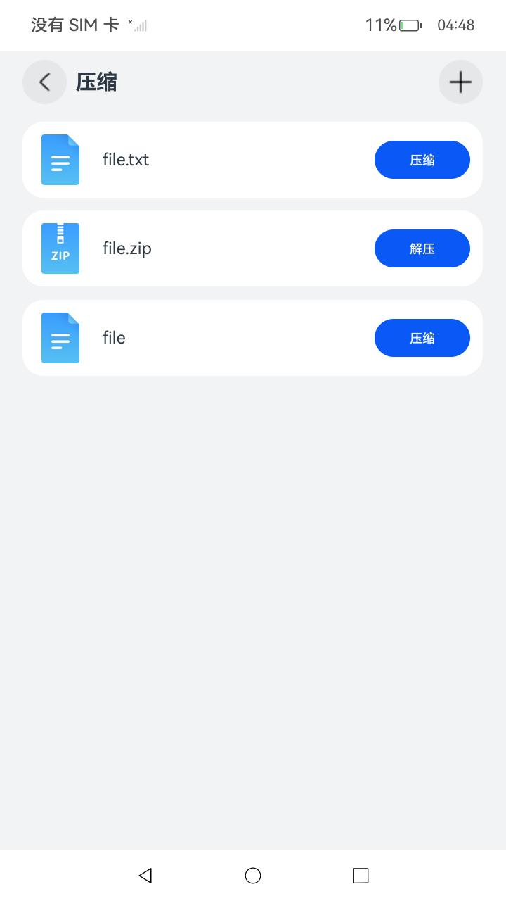

# 压缩与解压

### 介绍

本示例通过[@ohos.zlib](https://gitee.com/openharmony/docs/blob/master/zh-cn/application-dev/reference/apis-basic-services-kit/js-apis-zlib.md)
和[@ohos.fileio](https://gitee.com/openharmony/docs/blob/master/zh-cn/application-dev/reference/apis-core-file-kit/js-apis-fileio.md) 接口，实现添加文件、解压和压缩文件场景。

### 效果预览

|                            主页面                            |                      zlib解压缩文件页面                      |                    zlib相关接口调用页面                     |                      压缩多个文件页面                       |
| :----------------------------------------------------------: | :----------------------------------------------------------: | :---------------------------------------------------------: | :---------------------------------------------------------: |
|  |  |  |  |

使用说明

zlib解压缩文件

1.点击屏幕右上角 **+** 按钮，弹出创建文件窗口。

2.输入文件名称、文件内容，并点击 **确定** 按钮来创建文件。

3.文件创建成功后，文件名称自动追加.txt后缀并在主页面列表会显示，同时文件的物理地址为/data/app/el2/100/base/ohos.samples.ziplib/haps/entry/files/，点击 **压缩** 按钮，提示“文件压缩成功”，并会在文件列表创建一个相同名称的.zip文件。

4.点击压缩文件后的 **解压** 按钮，提示“文件解压成功”，并会再次在文件列表创建一个同名文件夹。


压缩多个文件使用说明：

1.主界面点击**zLib相关接口调用**按钮，进入 zLib相关接口调用界面。

2.点击屏幕上方**压缩多个文件**，跳转到压缩多个文件界面。

3.点击屏幕右上角的 **+**按钮，弹出创建文件窗口。

4.输入文件名称、文件内容，并点击 **确定** 按钮来创建文件，重复操作，创建多个文件。

5.文件创建成功后，文件名称自动追加.txt后缀并在主页面列表会显示，同时文件的物理地址为/data/app/el2/100/base/ohos.samples.ziplib/haps/entry/files/，

点击 **压缩** 按钮，提示“压缩多个文件成功”，并会在文件列表创建一个名称为test.zip的文件。


gzip格式解压缩使用说明：

1.主界面点击**zLib相关接口调用**按钮，进入zLib相关接口调用界面。

2.zLib相关接口调用界面中点击**gzip格式解压缩**按钮，提示“gzip文件压缩成功，压缩数据为:hello,hello!"，数据压入gzipTest.gz文件中，同时文件的物理地址为/data/app/el2/100/base/ohos.samples.ziplib/haps/entry/cache/。

3.等待约3s后，提示“gzip文件解压成功，解压数据为:hello,hello!"，并将解压后的结果写入gzipTest.txt文件中，同时文件的物理地址为/data/app/el2/100/base/ohos.samples.ziplib/haps/entry/cache/。


zlib格式解压缩使用说明：

1.主界面点击**zLib相关接口调用**按钮，进入zLib相关接口调用界面。

2.zLib相关接口调用界面中点击**zlib格式解压缩**按钮，提示“zlib文件压缩成功，压缩数据为: hello,hello!"，并将压缩后的结果写入zlibDeflateFile.txt文件中，同时文件的物理地址为/data/app/el2/100/base/ohos.samples.ziplib/haps/entry/cache/。

3.等待约3s后，提示“zlib文件解压成功，解压数据为: hello,hello!"，并将解压后的结果写入zlibInflateFile.txt文件中，同时文件的物理地址为/data/app/el2/100/base/ohos.samples.ziplib/haps/entry/cache/。


### 工程目录

```
entry/src/main/ets/
|---common
|   |---AddDialog.ets                       // 弹窗组件
|---entryability
|---model
|   |---DataSource.ets                      // 懒加载文件
|   |---Logger.ts                           // 日志文件
|---zlib
|   |---CompressFilesPage.ets               // 压缩多个文件
|   |---ZipLibDecompressionPage.ets         // ZipLib解压缩界面
|   |---ZlibInterfaceListPage.ets           // 接口分类界面，包含zlib解压缩、gzip解压缩、crc校验功能
|---pages
|   |---Index.ets                           // 首页
```

### 具体实现

* zlib解压缩文件功能，包含添加文件，解压和压缩文件的接口，源码参考[ZipLibDecompressionPage.ets](entry/src/main/ets/zlib/ZipLibDecompressionPage.ets)
  
  * 添加文件：通过调用fileio.openSync()创建文件并调用fileio.writeSync()向文件中写入内容。
  * 压缩文件：通过调用zlib.zipFile()压缩文件。
  * 解压文件：通过zlib.unzipFile解压文件。
* 压缩多个文件功能，包含添加文件和压缩文件的接口，源码参考[CompressFilesPage.ets](entry/src/main/ets/zlib/CompressFilesPage.ets)
  
  * 添加文件：通过调用fileio.openSync()创建文件并调用fileio.writeSync()向文件中写入内容。
  * 压缩多个文件：通过调用zlib.compressFiles()压缩指定的多个文件。
  * 计算压缩文件大小：通过调用getOriginalSize()计算.zip文件大小。
* zlib压缩和解压数据相关的接口，源码参考[ZlibInterfaceListPage.ets](entry/src/main/ets/zlib/ZlibInterfaceListPage.ets)
  
  * 创建zip对象：通过调用zlib.createZipSync()创建zip对象。
  * 压缩数据初始化：通过调用zip.deflateInit()进行压缩数据的初始化。
  
  * 校验数据：通过调用crc32()校验数据。
  * 压缩数据：通过调用zip.deflate()压缩数据。
  
  * 释放动态分配的数据结构：通过调用zip.deflateEnd()释放动态分配的数据结构。
  * 创建zip对象：通过调用zlib.createZipSync()创建zip对象。
  
  * 解压数据初始化：通过调用zip.inflateInit()进行解压数据的初始化。
  
  * 校验数据：通过调用crc32()校验数据。
  
  * 解压数据：通过调用zip.inflate()解压数据。
  
  * 释放动态分配的数据结构：通过调用zip.inflateEnd()释放动态分配的数据结构。
* gzip将数据压缩和解压相关的接口，源码参考[ZLibInterfaceListPage.ets](entry/src/main/ets/zlib/ZLibInterfaceListPage.ets)
  
  * 创建gzip对象：通过调用zlib.createGZipSync()创建gzip对象。
  * 打开文件：通过调用gzip.gzopen()打开文件并进行读写操作。
  
  * 将数据压缩并写入文件：通过调用gzip.gzfwrite()将数据压缩并写入文件。
  * 刷新文件：通过调用gzip.gzflush刷新文件。
  
  * 关闭文件：通过调用gzip.gzclose关闭文件。
  * 创建gzip对象：通过调用zlib.createGZipSync()创建gzip对象。
  
  * 打开文件：通过调用gzip.gzopen()打开文件并进行读写操作。
  
  * 从文件中读取和解压数据：通过调用gzip.gzfread()从文件中读取和解压数据。
  
  * 关闭文件：通过调用gzip.gzclose关闭文件。

### 相关权限

不涉及。

### 依赖

不涉及。

### 约束与限制

1.本示例仅支持标准系统上运行，支持设备：RK3568。

2.本示例需要使用DevEco Studio 4.1 Beta2 (Build Version: 4.1.0.400, built on April 9, 2024)才可编译运行。

3.解压与压缩相关接口的入参路径必须为context相关接口获取的相对路径，目前该接口仅支持操作应用目录下的文件。

4.本示例已适配API version 12版本SDK，版本号 5.0.0.28。

### 下载

如需单独下载本工程，执行如下命令：

```
git init
git config core.sparsecheckout true
echo code/LaunguageBaseClassLibrary/ZipLib/ > .git/info/sparse-checkout
git remote add origin https://gitee.com/openharmony/applications_app_samples.git
git pull origin master
```