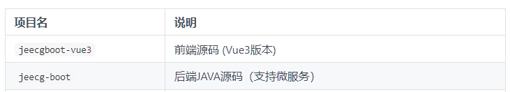
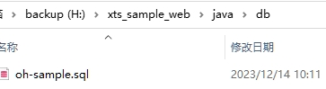
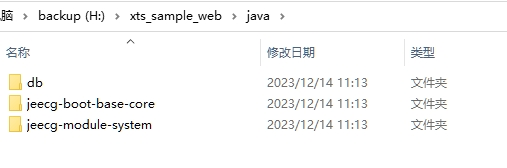
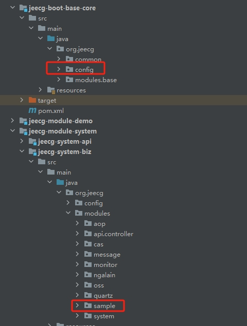
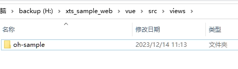
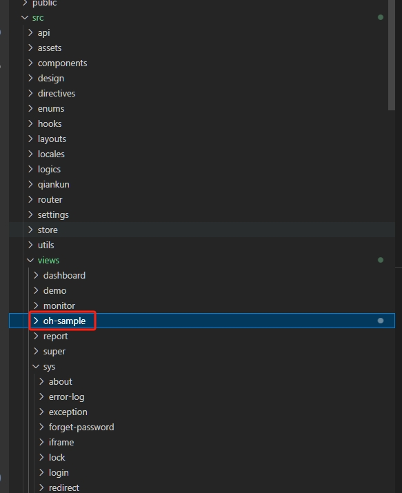
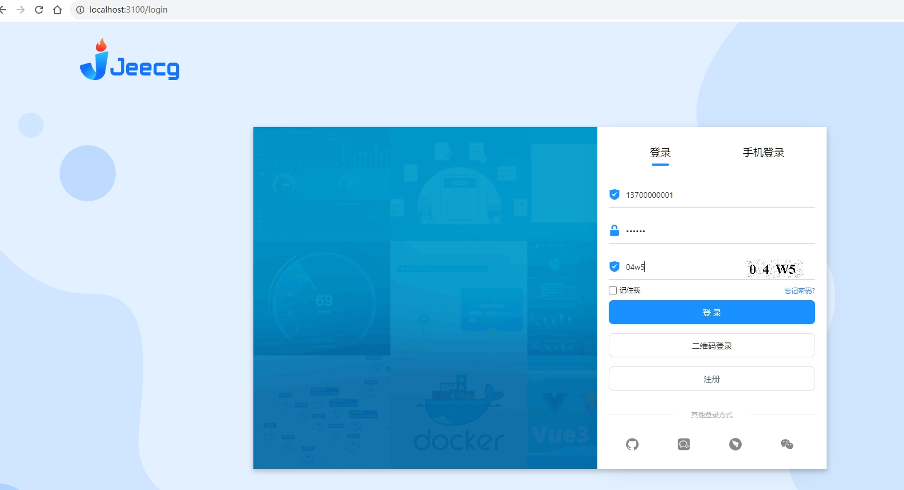
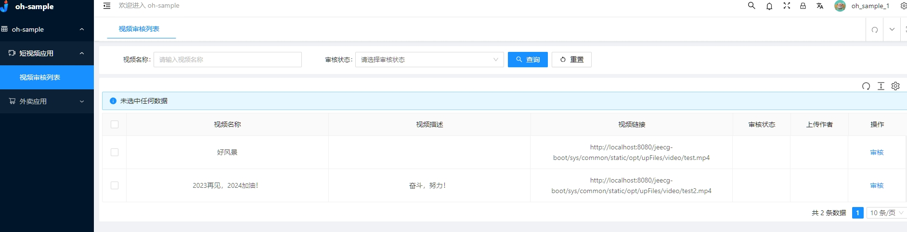
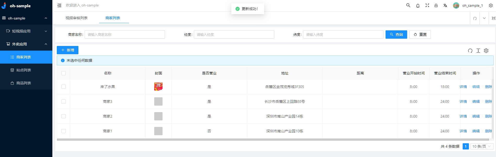

OpenHarmony Sample仿应用后台服务
===============

## 简介
本服务为[xts_tools sample](https://gitee.com/openharmony/xts_tools) sample中AppSampleD、AppSampleE提供的后台服务，如视频上传、视频审核、消息发送、商家列表及定位等，同时提供了相应的web后台管理页面，体验端云侧应用系统闭环。本服务使用了[JeecgBoot](http://www.jeecg.com) 低代码开发平台，能够快速的开发和部署。
 
 
## JeecgBoot源码下载

- 源码 ：https://gitee.com/jeecg/jeecg-boot

##### 项目说明

   

## 技术文档

-   官方文档：[http://help.jeecg.com](http://help.jeecg.com)
-   官方网站： [http://www.jeecg.com](http://www.jeecg.com)

## 安装与使用
- 按照Jeecg官方文档安装部署后，使用Navicat Premium工具或者其他数据库工具执行本应用服务需要的数据库文件脚本oh-sample.sql；

    

- 将java目录下jeecg-boot-base-core、jeecg-module-system的文件放置JeecgBoot SpringBoot后台项目源码对应目录中，如重复，使用本服务的文件，然后启动项目；

    
    

- 将前端web目录下的的oh-sample文件夹放置JeecgBoot前端源码对应目录中，修改对应服务器地址后，启动项目；

    
    

- 可使用默认账号13700000001、13700000002、13700000003，密码123456登录查看本服务提供的管理页面或者使用管理员账号admmin/123456体验整个系统；

    
    
    